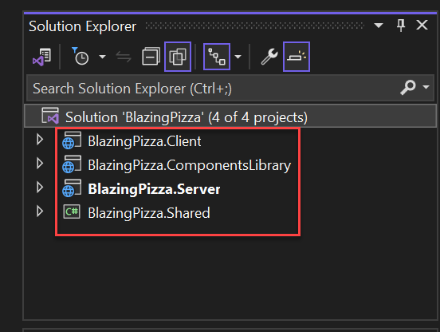
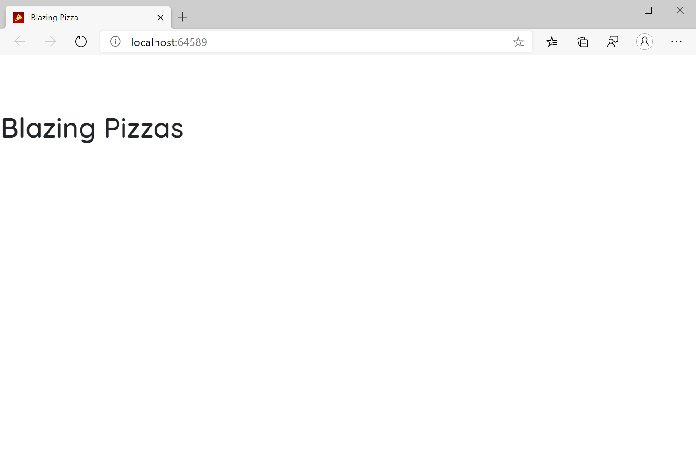
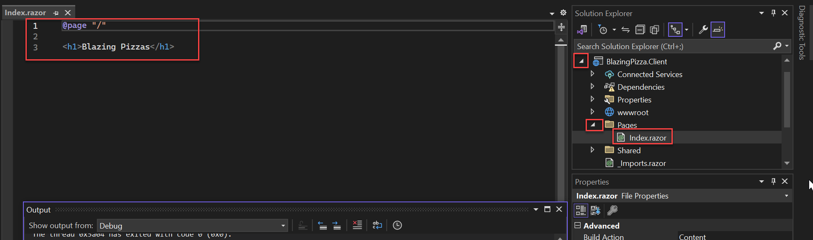
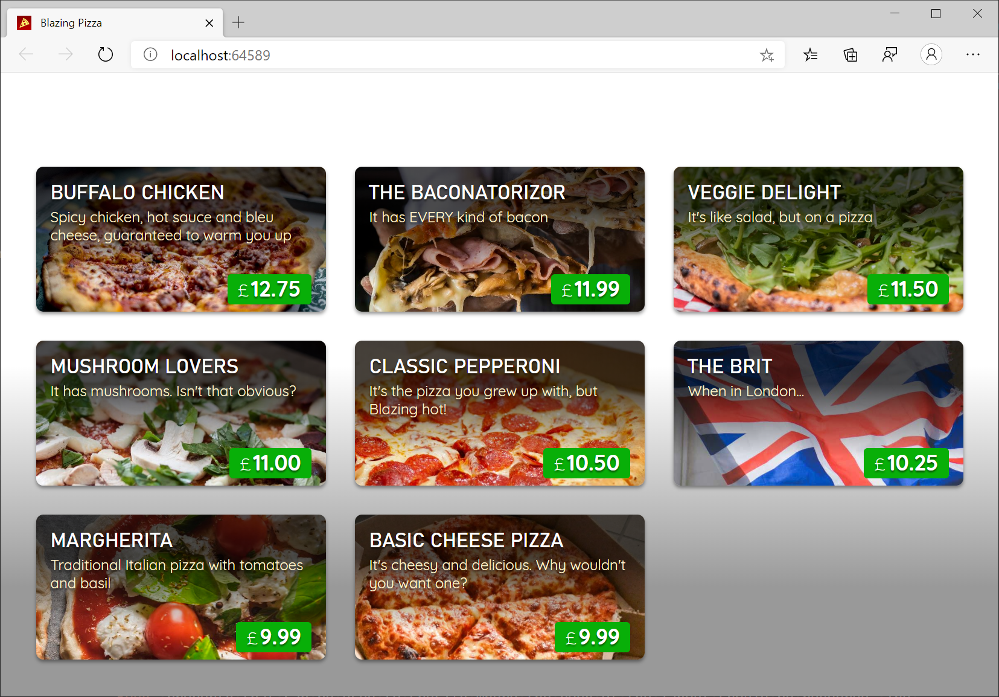
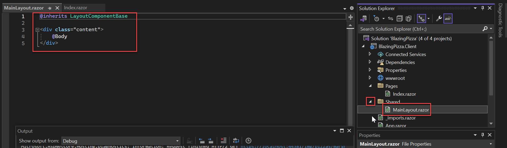
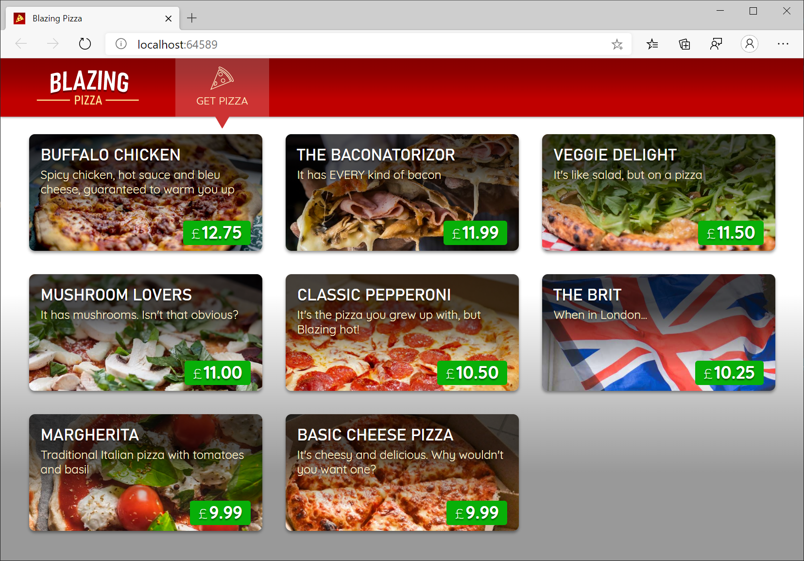

# Exercise 1: Components and layout

In this Exercise, you'll get started building a pizza store app using Blazor. The app will enable users to order pizzas, customize them, and then track the order deliveries.

## Task 1: Download and run the Sample App

Create a new folder on your computer called `BlazingPizza`, then download and extract the [Pizza Store sample app](https://opsgilitylabs.blob.core.windows.net/public/software-dev/BlazingPizza.zip) into that folder. Open the solution in `Visual Studio 2022`.

The solution already contains four projects:



- `BlazingPizza.Client`: This is the Blazor project. It contains the UI components for the app.

- `BlazingPizza.Server`: This is the ASP.NET Core project hosting the Blazor app and also the backend services for the app.

- `BlazingPizza.Shared`: This project contains the shared model types for the app.

- `BlazingPizza.ComponentsLibrary`: This is a library of components and helper code to be used by the app in later sessions.

The `BlazingPizza.Server` project should be set as the startup project.

When you run the app (click the green `IIS Express` play button at the top of Visual Studio), you'll see that it currently only contains a simple home page.



Click `Stop debugging` then expand the `BlazingPizza.Client` project. Expand the `Pages` folder and click `Index.razor` to see the code for the home page.



The home page is implemented as a single component. The `@page` directive specifies that the `Index` component is a routable page with the specified route.

## Task 2: Display the list of pizza specials

First we'll update the home page to display the list of available pizza specials. The list of specials will be part of the state of the `Index` component.

Add the below `@code` block to `*Index.razor`* with a list field to keep track of the available specials:

```csharp
@code {
    List<PizzaSpecial> specials;
}
```

The code in the `@code` block is added to the generated class for the component. The `PizzaSpecial` type is already defined for you in the `BlazingPizza.Shared` project.

To get the available list of specials we need to call an API on the backend. Blazor provides a preconfigured `HttpClient` through dependency injection that is already setup with the correct base address. Use the `@inject` directive to inject an `HttpClient` into the `Index` component.

Add the following directly below the `@page "/"` directive.

```
@inject HttpClient HttpClient
```

The `@inject` directive essentially defines a new property on the component where the first token specifies the property type and the second token specifies the property name. The property is populated for you using dependency injection.

Override the `OnInitializedAsync` method in the `@code` block to retrieve the list of pizza specials by replacing the `@code` block with the below. 

```csharp
@code {
    List<PizzaSpecial> specials;

    protected override async Task OnInitializedAsync()
    {
        specials = await HttpClient.GetFromJsonAsync<List<PizzaSpecial>>("specials", BlazingPizza.OrderContext.Default.ListPizzaSpecial);
    }
}
```

This method is part of the component lifecycle and is called when the component is initialized. Use the `GetFromJsonAsync<T>()` method to handle deserializing the response JSON:

The `/specials` API is defined by a minimal API at `PizzaApiExtensions.cs` in the `BlazingPizza.Server` project.

See also [Create a minimal web API with ASP.NET Core](https://docs.microsoft.com/en-us/aspnet/core/tutorials/min-web-api?view=aspnetcore-6.0) for additional details.

> `Note:` `BlazingPizza.OrderContext.Default.ListPizzaSpecial` refers to Json serialization with [source generators](https://docs.microsoft.com/en-us/dotnet/standard/serialization/system-text-json-source-generation).

Once the component is initialized it will render its markup. Replace the markup line `&lt;h1&gt;Blazing Pizzas&lt;&#x2F;h1&gt;` with the following to list the pizza specials:

```html
<div class="main">
    <ul class="pizza-cards">
        @if (specials != null)
        {
            @foreach (var special in specials)
            {
                <li style="background-image: url('@special.ImageUrl')">
                    <div class="pizza-info">
                        <span class="title">@special.Name</span>
                        @special.Description
                        <span class="price">@special.GetFormattedBasePrice()</span>
                    </div>
                </li>
            }
        }
    </ul>
</div>
```

Run the app by by pressing the green `IIS Express` at the top of Visual Studio. Now you should see a list of the specials that are available. You can click `Stop debugging` once complete.




## Task 3: Create the layout

Next we'll set up the layout for the app. 

Layouts in Blazor are also components. They inherit from `LayoutComponentBase`, which defines a `Body` property that can be used to specify where the body of the layout should be rendered. The layout component for our pizza store app is defined in `MainLayout.razor`, which can be found by expanding the `Shared` folder of the `BlazingPizza.Client` project.



To see how the layout is associated with your pages, look at the `<Router>` component in `App.razor` within the `BlazingPizza.Client` project. Notice that the `DefaultLayout` parameter determines the layout used for any page that doesn't specify its own layout directly.

You can also override this `DefaultLayout` on a per-page basis. To do so, you can add a directive such as `@layout SomeOtherLayout` at the top of any `.razor` page component. However, you will not need to do so in this app.

Update the `MainLayout` component to define a top bar with a branding logo and a nav link for the home page by replacing the contents of the `MainLayout.razor` file with the below:

```html
@inherits LayoutComponentBase

<div class="top-bar">
    <a class="logo" href="">
        
    </a>

    <NavLink href="" class="nav-tab" Match="NavLinkMatch.All">
        
        <div>Get Pizza</div>
    </NavLink>
</div>

<div class="content">
    @Body
</div>
```

The `NavLink` component is provided by Blazor. Components can be used from components by specifying an element with the component's type name along with attributes for any component parameters.

The `NavLink` component is the same as an anchor tag, except that it adds an `active` class if the current URL matches the link address. `NavLinkMatch.All` means that the link should be active only when it matches the entire current URL (not just a prefix). We'll examine the `NavLink` component in more detail in a later session.

Run the app by by pressing the green `IIS Express` at the top of Visual Studio. With our new layout, our pizza store app now looks like this:

