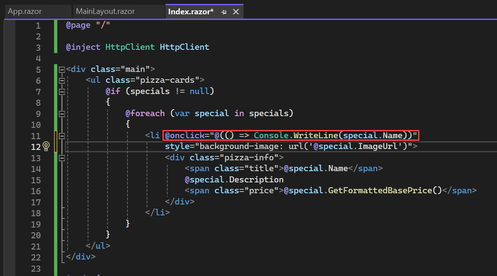
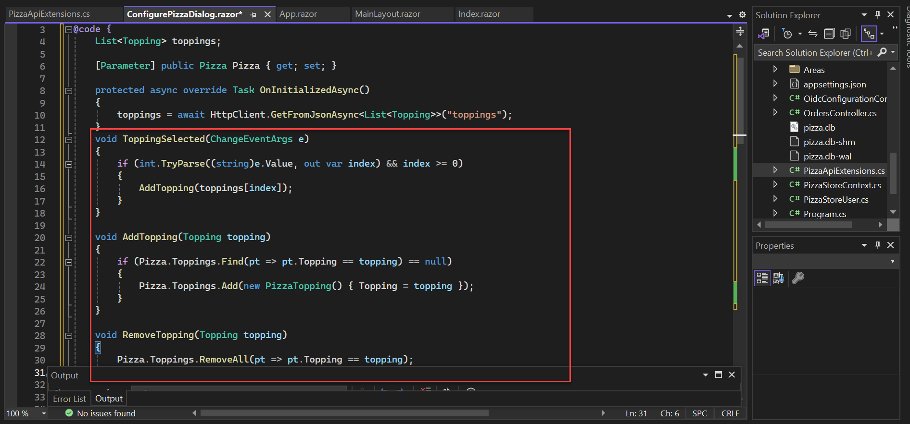

# Exercise 2: Customize a pizza

In this exercise, we'll update the pizza store app to enable users to customize their pizzas and add them to their order.

## Task 1: Event handling

When the user clicks a pizza special, a pizza customization dialog should pop up to allow the user to customize their pizza and add it to their order. To handle DOM UI events in a Blazor app, you specify which event you want to handle using the corresponding HTML attribute and then specify the C# delegate you want called. The delegate may optionally take an event specific argument, but it's not required.

In `Index.razor` add the following `@onclick` handler to the list item for each pizza special:

```
@onclick="@(() => Console.WriteLine(special.Name))" 
```

Your code should look like this after the change: 



Run the app by by pressing the green `IIS Express` at the top of Visual Studio. Check that the pizza name is written to the browser console whenever a pizza is clicked. 

> To view the console press `CTRL + SHIFT + I`.


The `@` symbol is used in Razor files to indicate the start of C# code. Surround the C# code with parens if needed to clarify where the C# code begins and ends.

Update the `@code` block in `Index.razor` to add some additional fields for tracking the pizza being customized and whether the pizza customization dialog is visible.

```csharp
Pizza configuringPizza;
bool showingConfigureDialog;
```


Add a `ShowConfigurePizzaDialog` method to the `@code` block (after the end of OnInitializedAsync) for handling when a pizza special is clicked.

```csharp
void ShowConfigurePizzaDialog(PizzaSpecial special)
{
    configuringPizza = new Pizza()
    {
        Special = special,
        SpecialId = special.Id,
        Size = Pizza.DefaultSize,
        Toppings = new List<PizzaTopping>(),
    };

    showingConfigureDialog = true;
}
```


Update the `@onclick` handler to call the `ShowConfigurePizzaDialog` method instead of `Console.WriteLine`.

```html
<li @onclick="@(() => ShowConfigurePizzaDialog(special))" style="background-image: url('@special.ImageUrl')">
```


## Task 2: Implement the pizza customization dialog

Now we need to implement the pizza customization dialog so we can display it when the user selects a pizza. The pizza customization dialog will be a new component that lets you specify the size of your pizza and what toppings you want, shows the price, and lets you add the pizza to your order.

We will need to add a `ConfigurePizzaDialog.razor` file under the `Shared` folder. Since this component is not a separate page, it does not need the `@page` directive. 

1. To do this, right-click the `Shared` folder in `Solution Explorer` and click `Add` then `Razor Component`.

    

2. Set the file's name to `ConfigurePizzaDialog.razor` and click `Add`. 

    

The `ConfigurePizzaDialog` should have a `Pizza` parameter that specifies the pizza being configured. Component parameters are defined by adding a writable property to the component decorated with the `[Parameter]` attribute. Add a `@code` block to the `ConfigurePizzaDialog` with the following `Pizza` parameter:

```csharp
@code {
    [Parameter] public Pizza Pizza { get; set; }
}
```


>`Note:` Component parameter values need to have a setter and be declared `public` because they get set by the framework. However, they should *only* be set by the framework as part of the rendering process. Don't write code that overwrites these parameter values from outside the component, because then your component's state will be out of sync with its render output.

Add the following basic markup to the `ConfigurePizzaDialog.razor` file below the `@code` block:

```html
<div class="dialog-container">
    <div class="dialog">
        <div class="dialog-title">
            <h2>@Pizza.Special.Name</h2>
            @Pizza.Special.Description
        </div>
        <form class="dialog-body"></form>
        <div class="dialog-buttons">
            <button class="btn btn-secondary mr-auto">Cancel</button>
            <span class="mr-center">
                Price: <span class="price">@(Pizza.GetFormattedTotalPrice())</span>
            </span>
            <button class="btn btn-success ml-auto">Order</button>
        </div>
    </div>
</div>
```


Return to the `Index.razor` file under the `Pages` folder. Update it to show the `ConfigurePizzaDialog` when a pizza special has been selected. Add the following code, below the closing div and before the @code block start. 

```html
@if (showingConfigureDialog)
{
    <ConfigurePizzaDialog Pizza="configuringPizza" />
}
```


Run the app by by pressing the green `IIS Express` at the top of Visual Studio. Select a pizza special to see the skeleton of the `ConfigurePizzaDialog`.


Unfortunately at this point there's no functionality in place to close the dialog. We'll add that shortly. Let's get to work on the dialog itself.

## Task 3: Data binding

The user should be able to specify the size of their pizza. Add markup to the body of `ConfigurePizzaDialog.razor` for a slider that lets the user specify the pizza size. This should replace the existing `<form class="dialog-body"></form>` element.

```html
<form class="dialog-body">
    <div>
        <label>Size:</label>
        <input type="range" min="@Pizza.MinimumSize" max="@Pizza.MaximumSize" step="1" />
        <span class="size-label">
            @(Pizza.Size)" (£@(Pizza.GetFormattedTotalPrice()))
        </span>
    </div>
</form>
```


Now the dialog shows a slider that can be used to change the pizza size. However it doesn't do anything right now if you use it.


We want the value of `Pizza.Size` to reflect the value of the slider. When the dialog opens, the slider gets its value from `Pizza.Size`. Moving the slider should update the pizza size stored in `Pizza.Size` accordingly. This concept is called two-way binding.

We'd prefer to see updates as the slider is moved. Data binding in Blazor allows for this by letting you specify which event triggers a change using the syntax `@bind:<eventname>`. So, to bind using the `oninput` event, do this:

Modify the input in the `ConfigurePizzaDialog.razor` to match the following:

```html
<input type="range" min="@Pizza.MinimumSize" max="@Pizza.MaximumSize" step="1" @bind="Pizza.Size" @bind:event="oninput" />
```


Run the app by by pressing the green `IIS Express` at the top of Visual Studio. Select a pizza special. The pizza size should now update as you move the slider.


## Task 4: Add additional toppings

The user should also be able to select additional toppings on `ConfigurePizzaDialog`. Add a list for storing the available toppings. Initialize the list of available toppings by making an HTTP GET request to the `/toppings` minimal API, defined at `PizzaApiExtensions.cs` in the `BlazingPizza.Server` project.

1. In the `ConfigurePizzaDialog.razor` file, add the following above the `<div class="dialog-container">` line. 

    ```
    @inject HttpClient HttpClient
    ```

2. Replace the contents of the `@code` block with the following.

    ```csharp
    @code {
        List<Topping> toppings;

        [Parameter] public Pizza Pizza { get; set; }

        protected async override Task OnInitializedAsync()
        {
            toppings = await HttpClient.GetFromJsonAsync<List<Topping>>("toppings");
        }
    }
    ```

3. Your code should like this:

    

Add the following markup in the dialog body for displaying a drop down list with the list of available toppings followed by the set of selected toppings. Put the following inside the `<form class="dialog-body">`, below the existing `<div>` tags as shown in the screenshot.

```html
<div>
    <label>Extra Toppings:</label>
    @if (toppings == null)
    {
        <select class="custom-select" disabled>
            <option>(loading...)</option>
        </select>
    }
    else if (Pizza.Toppings.Count >= 6)
    {
        <div>(maximum reached)</div>
    }
    else
    {
        <select class="custom-select" @onchange="ToppingSelected">
            <option value="-1" disabled selected>(select)</option>
            @for (var i = 0; i < toppings.Count; i++)
            {
                <option value="@i">@toppings[i].Name - (£@(toppings[i].GetFormattedPrice()))</option>
            }
        </select>
    }
</div>

<div class="toppings">
    @foreach (var topping in Pizza.Toppings)
    {
        <div class="topping">
            @topping.Topping.Name
            <span class="topping-price">@topping.Topping.GetFormattedPrice()</span>
            <button type="button" class="delete-topping" @onclick="@(() => RemoveTopping(topping.Topping))">x</button>
        </div>
    }
</div>
```


Also add the following event handlers to the `@code` block for topping selection and removal:

```csharp
void ToppingSelected(ChangeEventArgs e)
{
    if (int.TryParse((string)e.Value, out var index) && index >= 0)
    {
        AddTopping(toppings[index]);
    }
}

void AddTopping(Topping topping)
{
    if (Pizza.Toppings.Find(pt => pt.Topping == topping) == null)
    {
        Pizza.Toppings.Add(new PizzaTopping() { Topping = topping });
    }
}

void RemoveTopping(Topping topping)
{
    Pizza.Toppings.RemoveAll(pt => pt.Topping == topping);
}
```



Run the app by by pressing the green `IIS Express` at the top of Visual Studio. Select a pizza special. You should now be able to add and remove toppings.


## Task 5: Component events

The Cancel and Order buttons don't do anything yet. We need some way to communicate to the `Index` component when the user adds the pizza to their order or cancels. We can do that by defining component events. Component events are callback parameters that parent components can subscribe to.

Add two parameters to the `ConfigurePizzaDialog.razor` file's `@code` block below the `Pizza` paramter: `OnCancel` and `OnConfirm`. Both parameters should be of type `EventCallbac``.

```csharp
[Parameter] public EventCallback OnCancel { get; set; }
[Parameter] public EventCallback OnConfirm { get; set; }
```


Add `@onclick` event handlers to the `ConfigurePizzaDialog.razor` file that trigger the `OnCancel` and `OnConfirm` events.

Replace the `<div class="dialog-buttons">` block with the following: 

```html
<div class="dialog-buttons">
    <button class="btn btn-secondary mr-auto" @onclick="OnCancel">Cancel</button>
    <span class="mr-center">
        Price: <span class="price">@(Pizza.GetFormattedTotalPrice())</span>
    </span>
    <button class="btn btn-success ml-auto" @onclick="OnConfirm">Order ></button>
</div>
```


In the `Index.razor` file, add the below event handler for the `OnCancel` event that hides the dialog and wires it to the `ConfigurePizzaDialog.razor` file. Replace the `<ConfigurePizzaDialog Pizza="configuringPizza" />` line in the `@if (showingConfigureDialog)` statement with the following:

```html
<ConfigurePizzaDialog Pizza="configuringPizza" OnCancel="CancelConfigurePizzaDialog" />
```


Add the following to the bottom of the `@code` block in the `Index.razor` file.

```csharp
void CancelConfigurePizzaDialog()
{
    configuringPizza = null;
    showingConfigureDialog = false;
}
```


Now when you click the dialog's Cancel button, `Index.CancelConfigurePizzaDialog` will execute, and then the `Index` component will rerender itself. Since `showingConfigureDialog` is now `false` the dialog will not be displayed.

Normally what happens when you trigger an event (like clicking the Cancel button) is that the component that defined the event handler delegate will rerender. You could define events using any delegate type like `Action` or `Func<string, Task>`. Sometimes you want to use an event handler delegate that doesn't belong to a component - if you used a normal delegate type to define the event then nothing will be rendered or updated.

`EventCallback` is a special type that is known to the compiler that resolves some of these issues. It tells the compiler to dispatch the event to the component that contains the event handler logic. `EventCallback` has a few more tricks up its sleeve, but for now just remember that using `EventCallback` makes your component smart about dispatching events to the right place.

Run the app and verify that the dialog now disappears when the `Cancel` button is clicked.


When the `OnConfirm` event is fired, the customized pizza should be added to the user's order. Add an `Order` field to the `Index.razor` file to track the user's order.

Add the below line to the `@code` block of `Index.razor` as shown in the screenshots. 

```csharp
Order order = new Order();
```


In the `Index.razor` file, add an event handler for the `OnConfirm` event that adds the configured pizza to the order and wire it to the `ConfigurePizzaDialog`. Replace the `<ConfigurePizzaDialog Pizza="configuringPizza" />` line in the `@if (showingConfigureDialog)` statement with tthe following:

```html
<ConfigurePizzaDialog Pizza="configuringPizza" OnCancel="CancelConfigurePizzaDialog" OnConfirm="ConfirmConfigurePizzaDialog"/>
```


Add the following to the bottom of the `@code` block in the `Index.razor` file.

```csharp
void ConfirmConfigurePizzaDialog()
{
    order.Pizzas.Add(configuringPizza);
    configuringPizza = null;

    showingConfigureDialog = false;
}
```


Run the app and verify the dialog now disappears when the Order button is clicked. We can't see yet that a pizza was added to the order because there's no UI that shows this information. We'll address that next.


## Task 6: Display the current order

Next we need to display the configured pizzas in the current order, calculate the total price, and provide a way to place the order.

Create a new `ConfiguredPizzaItem.razor` file for displaying a configured pizza. It takes two parameters: the configured pizza, and an event for when the pizza was removed.

1. To do this, right-click the `Shared` folder in `Solution Explorer` and click `Add` then `Razor Component`.

    

2. Set the file's name to `ConfiguredPizzaItem.razor` and click `Add`. 

    

3. Replace the contents of the file with the following:

```html
<div class="cart-item">
    <a @onclick="OnRemoved" class="delete-item">x</a>
    <div class="title">@(Pizza.Size)" @Pizza.Special.Name</div>
    <ul>
        @foreach (var topping in Pizza.Toppings)
        {
        <li>+ @topping.Topping.Name</li>
        }
    </ul>
    <div class="item-price">
        @Pizza.GetFormattedTotalPrice()
    </div>
</div>

@code {
    [Parameter] public Pizza Pizza { get; set; }
    [Parameter] public EventCallback OnRemoved { get; set; }
}
```


4. Add the following markup to the `Index.razor` file just below the `main` div to add a right side pane for displaying the configured pizzas in the current order.

```html
<div class="sidebar">
    @if (order.Pizzas.Any())
    {
        <div class="order-contents">
            <h2>Your order</h2>

            @foreach (var configuredPizza in order.Pizzas)
            {
                <ConfiguredPizzaItem Pizza="configuredPizza" OnRemoved="@(() => RemoveConfiguredPizza(configuredPizza))" />
            }
        </div>
    }
    else
    {
        <div class="empty-cart">Choose a pizza<br>to get started</div>
    }

    <div class="order-total @(order.Pizzas.Any() ? "" : "hidden")">
        Total:
        <span class="total-price">@order.GetFormattedTotalPrice()</span>
        <button class="btn btn-warning" disabled="@(order.Pizzas.Count == 0)" @onclick="PlaceOrder">
            Order >
        </button>
    </div>
</div>
```


5. Also add the following event handlers to the `Index` component for removing a configured pizza from the order and submitting the order.

```csharp
void RemoveConfiguredPizza(Pizza pizza)
{
    order.Pizzas.Remove(pizza);
}

async Task PlaceOrder()
{
    await HttpClient.PostAsJsonAsync("orders", order);
    order = new Order();
}
```


6. Run the app and verify that you can add and remove configured pizzas from the order and submit the order.


Even though the order was successfully added to the database, there's nothing in the UI yet that indicates this happened. That's what we'll address in the next session.