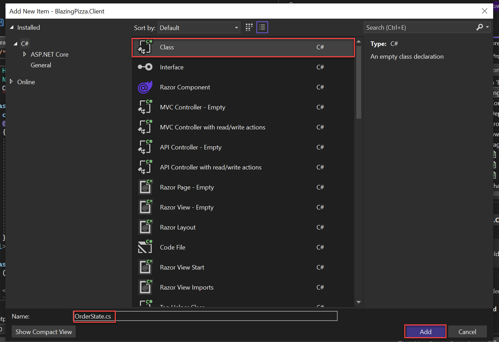
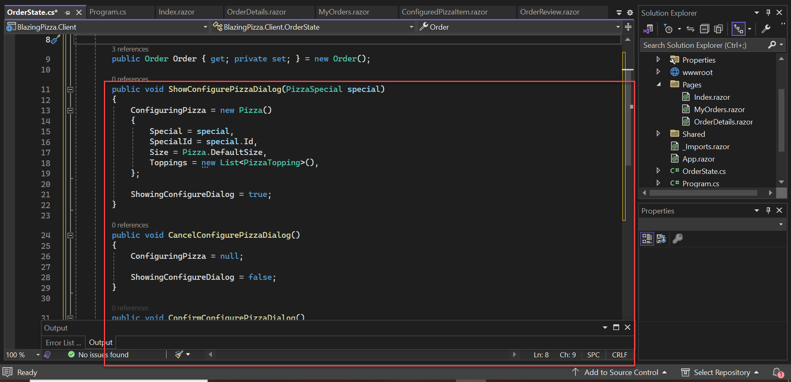

# Exercise 4: Refactor state management

In this exercise, we'll revisit some of the code we've already written and try to make it nicer. We'll also talk more about eventing and how events cause the UI to update.

## A problem

You might have noticed this already, but our application has a bug! Since we're storing the list of pizzas in the current order on the Index component, the user's state can be lost if the user leaves the Index page. To see this in action, add a pizza to the current order (don't place the order yet) - then navigate to the MyOrders page and back to Index. When you get back, you'll notice the order is empty!

## A solution

We're going to fix this bug by introducing something we've dubbed the *AppState pattern*. The *AppState pattern* adds an object to the DI container that you will use to coordinate state between related components. Because the *AppState* object is managed by the DI container, it can outlive the components and hold on to state even when the UI changes. Another benefit of the *AppState pattern* is that it leads to greater separation between presentation (components) and business logic. 

## Task 1: Getting started

Create a new class called `OrderState` in the Client Project root directory by right-clicking `BlazingPizza.client`, selecting `Add` then `New item`. 


Select `Class` then enter `OrderState.cs` for the file's name. 



Register it as a scoped service in the DI container. In Blazor WebAssembly applications, services are registered in the `Program` class. Add the service just before the call to `await builder.Build().RunAsync();`. Replace the contents of the `Program.cs` file with the following.

```csharp
using BlazingPizza.Client;
using Microsoft.AspNetCore.Components.Web;
using Microsoft.AspNetCore.Components.WebAssembly.Hosting;

var builder = WebAssemblyHostBuilder.CreateDefault(args);
builder.RootComponents.Add<App>("#app");
builder.RootComponents.Add<HeadOutlet>("head::after");

builder.Services.AddScoped(sp => new HttpClient { BaseAddress = new Uri(builder.HostEnvironment.BaseAddress) });
builder.Services.AddScoped<OrderState>();

await builder.Build().RunAsync();
```

>`Note:` the reason why we choose scoped over singleton is for symmetry with a server-side-components application. Singleton usually means *for all users*, where as scoped means *for the current unit-of-work*.

## Updating Index

Now that this type is registered in DI, we can `@inject` it into the `Index` page. Add the following directive to the `Index.razor` file. 

```razor
@inject OrderState OrderState
```


Recall that `@inject` is a convenient shorthand to both retrieve something from DI by type, and define a property of that type.

You can test this now by running the app again. If you try to inject something that isn't found in the DI container, then it will throw an exception and the `Index` page will fail to come up.

Now, let's add properties and methods to this class that will represent and manipulate the state of an `Order` and a `Pizza`.

Move the `configuringPizza`, `showingConfigureDialog` and `order` fields to be properties on the `OrderState` class. Make them `private set` so they can only be manipulated via methods on `OrderState`.

```csharp
public class OrderState
{
    public bool ShowingConfigureDialog { get; private set; }

    public Pizza ConfiguringPizza { get; private set; }

    public Order Order { get; private set; } = new Order();
}
```


Now let's move some of the methods from the `Index` to `OrderState`. We won't move `PlaceOrder` into `OrderState` because that triggers a navigation, so instead we'll just add a `ResetOrder` method.

```csharp
public void ShowConfigurePizzaDialog(PizzaSpecial special)
{
    ConfiguringPizza = new Pizza()
    {
        Special = special,
        SpecialId = special.Id,
        Size = Pizza.DefaultSize,
        Toppings = new List<PizzaTopping>(),
    };

    ShowingConfigureDialog = true;
}

public void CancelConfigurePizzaDialog()
{
    ConfiguringPizza = null;

    ShowingConfigureDialog = false;
}

public void ConfirmConfigurePizzaDialog()
{
    Order.Pizzas.Add(ConfiguringPizza);
    ConfiguringPizza = null;

    ShowingConfigureDialog = false;
}

public void ResetOrder()
{
    Order = new Order();
}

public void RemoveConfiguredPizza(Pizza pizza)
{
    Order.Pizzas.Remove(pizza);
}
```



Remember to remove the corresponding methods from `Index.razor`. You must also remember to remove the `order`, `configuringPizza`, and `showingConfigureDialog` fields entirely from `Index.razor`, since you'll be getting the state data from the injected `OrderState`.

At this point it should be possible to get the `Index.razor` file compiling again by updating references to refer to various bits attached to `OrderState`. For example, the remaining `PlaceOrder` method in `Index.razor` should look like this:

```csharp
async Task PlaceOrder()
{
    var response = await HttpClient.PostAsJsonAsync("orders", OrderState.Order);
    var newOrderId = await response.Content.ReadFromJsonAsync<int>();
    OrderState.ResetOrder();
    NavigationManager.NavigateTo($"myorders/{newOrderId}");
}
```


Feel free to create convenience properties for things like `OrderState.Order` or `OrderState.Order.Pizzas` if it feels better to you that way.

Try this out and verify that everything still works. In particular, verify that you've fixed the original bug: you can now add some pizzas, navigate to "My orders", navigate back, and your order has no longer been lost.

## Task 2: Exploring state changes

This is a good opportunity to explore how state changes and rendering work in Blazor, and how `EventCallback` solves some common problems. The details of what is happening become more complicated now that `OrderState` is involved.

`EventCallback` tells Blazor to dispatch the event notification (and rendering) to the component that defined the event handler. If the event handler is not defined by a component (`OrderState`) then it will substitute the component that *hooked up* the event handler (`Index`).

## Conclusion

So let's sum up what the *AppState pattern* provides:
- Moves shared state outside of components into `OrderState`
- Components call methods to trigger a state change
- `EventCallback` takes care of dispatching change notifications

We've covered a lot of information as well about rendering and eventing:
- Components re-render when parameters change or they receive an event
- Dispatching of events depends on the event handler delegate target
- Use `EventCallback` to have the most flexible and friendly behavior for dispatching events