# Exercise 8: Templated components

Let's refactor some of the original components and make them more reusable. Along the way we'll also create a separate library project as a home for the new components.

We're going to create a new project using the Razor Class Library template.

## Task 1: Creating a component library (Visual Studio)

Using Visual Studio, right click `Solution...` at the very top of solution explorer, and choose `Add` then `New Project`. 

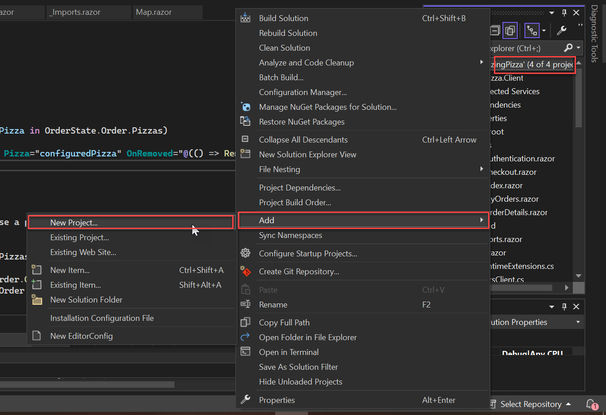

Then, search for and select the `Razor Class Library` template. Click `Next`.

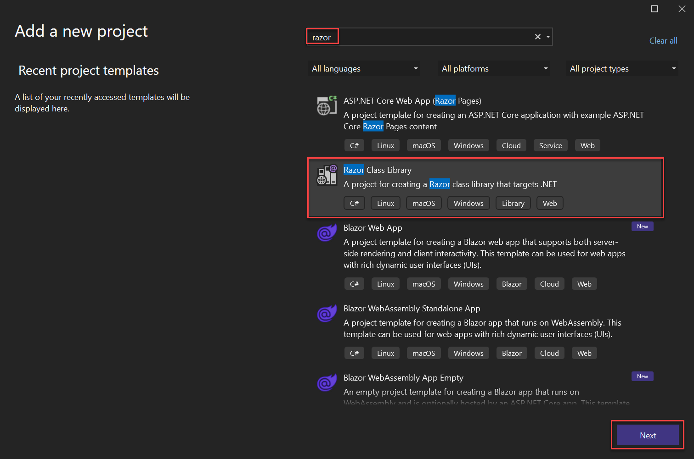

Enter the project name `BlazingComponents` and click `Next` then `Create`.

## Task 2: Understanding the library project

Open the project file by double-clicking the `BlazingComponents` project name in *Solution explorer*. We're not going to modify anything here, but it would be good to understand a few things.

It looks like:

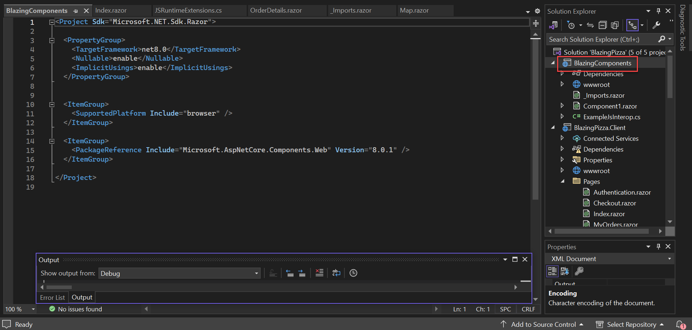

There are a few things here worth understanding. 

Firstly, the package targets `netstandard2.0`. Blazor Server uses `netcoreapp3.1` and Blazor WebAssembly uses `netstandard2.1` - so targeting `netstandard2.0` means that it will work for either scenario.

Additional, the `<RazorLangVersion>3.0</RazorLangVersion>` sets the Razor language version. Version 3 is needed to support components and the `.razor` file extension. 

Lastly the `<PackageReference />` element adds a package references to the Blazor component model.

## Writing a templated dialog

We are going to revisit the dialog system that is part of `Index` and turn it into something that's decoupled from the application.

Let's think about how a *reusable dialog* should work. We would expect a dialog component to handle showing and hiding itself, as well as maybe styling to appear visually as a dialog. However, to be truly reusable, we need to be able to provide the content for the inside of the dialog. We call a component that accepts *content* as a parameter a *templated component*.

Blazor happens to have a feature that works for exactly this case, and it's similar to how a layout works. Recall that a layout has a `Body` parameter, and the layout gets to place other content *around* the `Body`. In a layout, the `Body` parameter is of type `RenderFragment` which is a delegate type that the runtime has special handling for. The good news is that this feature is not limited to layouts. Any component can declare a parameter of type `RenderFragment`. We've also used this feature extensively in `App.razor`. All of the components used to handle routing and authorization are templated components.

Let's get started on this new dialog component. Create a new razor file in the `BlazingComponents` project called `TemplatedDialog.razor`. Put the following markup inside `TemplatedDialog.razor` above the `@code`:

```html
<div class="dialog-container">
    <div class="dialog">

    </div>
</div>
```

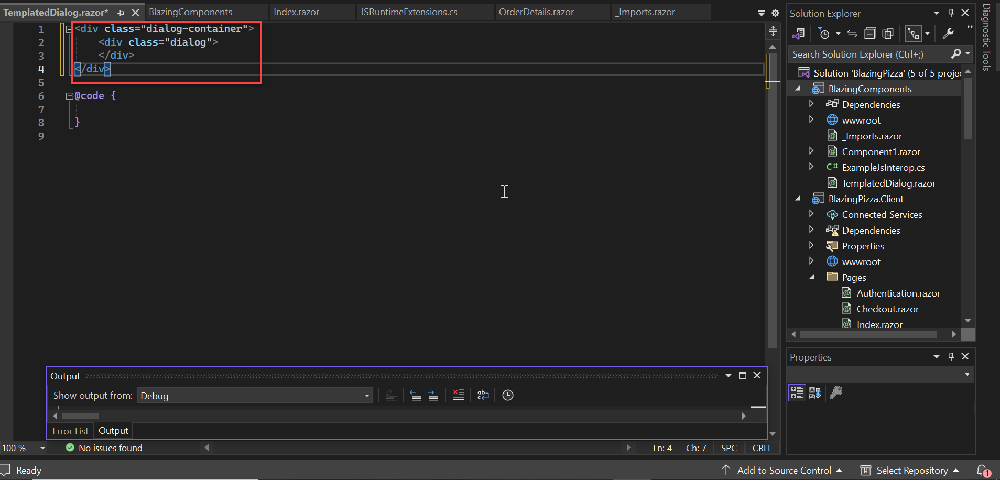

This doesn't do anything yet because we haven't added any parameters. Recall from before the two things we want to accomplish.

- Accept the content of the dialog as a parameter

- Render the dialog conditionally if it is supposed to be shown

First, add a parameter called `ChildContent` of type `RenderFragment` to the `@code` block of the file. The name `ChildContent` is a special parameter name, and is used by convention when a component wants to accept a single content parameter.

```razor
[Parameter] public RenderFragment ChildContent { get; set; }
```

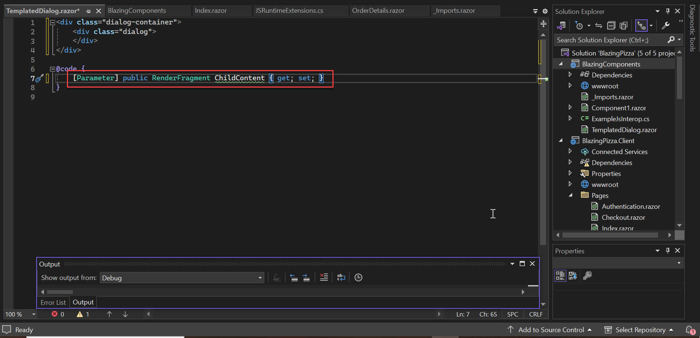

Next, update the markup to *render* the `ChildContent` in the middle of the markup. It should look like this:

```html
<div class="dialog-container">
    <div class="dialog">
        @ChildContent
    </div>
</div>
```

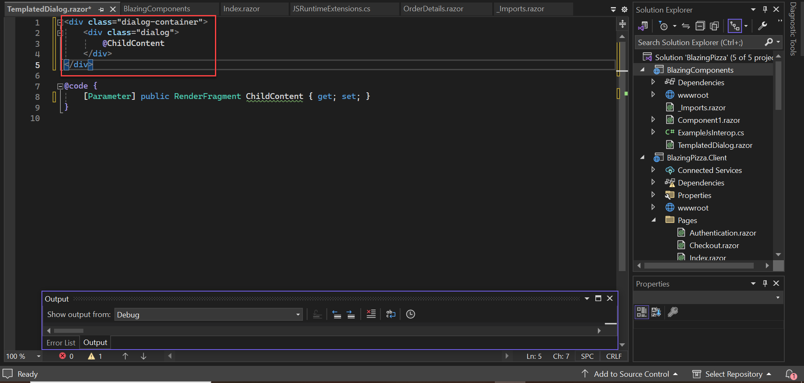

If this structure looks weird to you, cross-check it with your layout file, which follows a similar pattern. Even though `RenderFragment` is a delegate type, the way to *render* it is not by invoking it, it's by placing the value in a normal expression so the runtime may invoke it.

Next, to give this dialog some conditional behavior, let's add a parameter of type `bool` called `Show`. After doing that, it's time to wrap all of the existing content in an `@if (Show) { ... }`. The full file should look like this:

```html
@if (Show)
{
    <div class="dialog-container">
        <div class="dialog">
            @ChildContent
        </div>
    </div>
}

@code {
    [Parameter] public RenderFragment ChildContent { get; set; }
    [Parameter] public bool Show { get; set; }
}
```

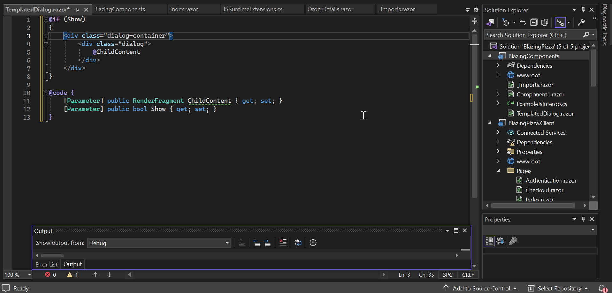

## Task 3: Adding a reference to the templated library

Before we can use this component in the `BlazingPizza.Client` project, we will need to add a project reference. Do this by right-clicking `BlazingPizza.client`, click `Add`, then `Project reference`. Check the `BlazingComponents` box and click `OK`.

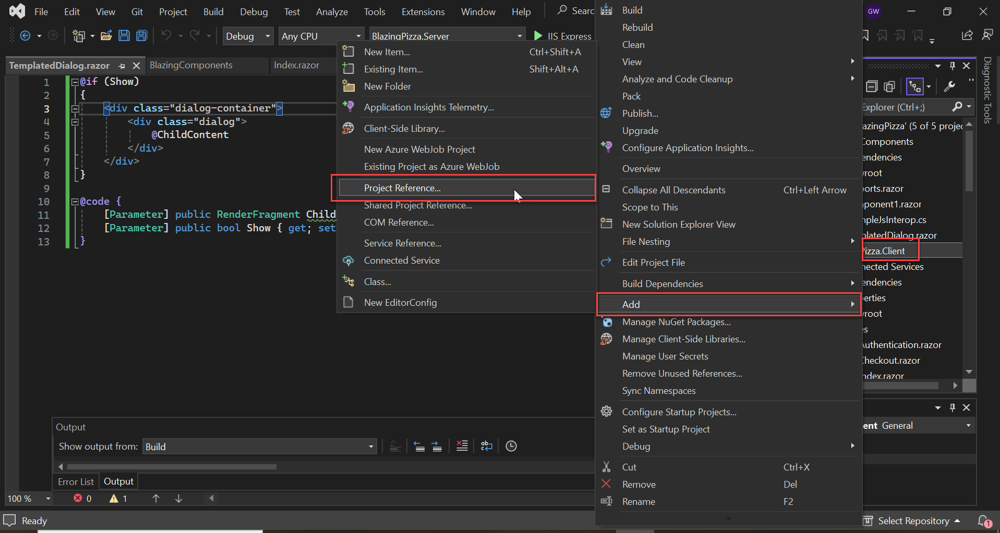

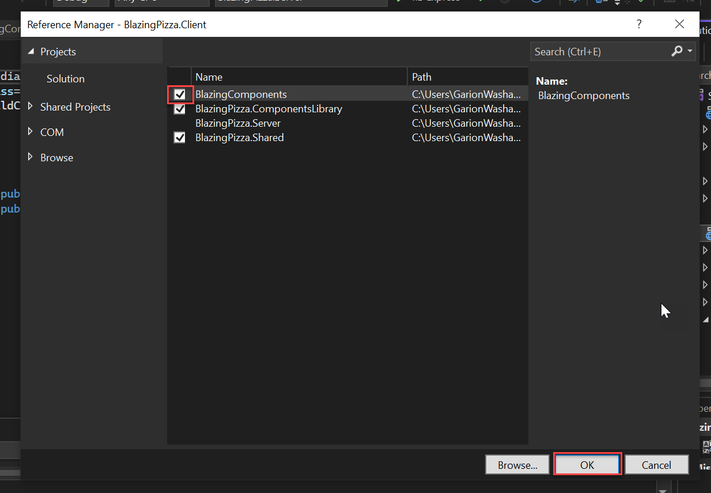


Once that's done, there's one more minor step. Open  `_Imports.razor` in the `BlazingPizza.Client` project and add this line at the bottom:

```html
@using BlazingComponents
```

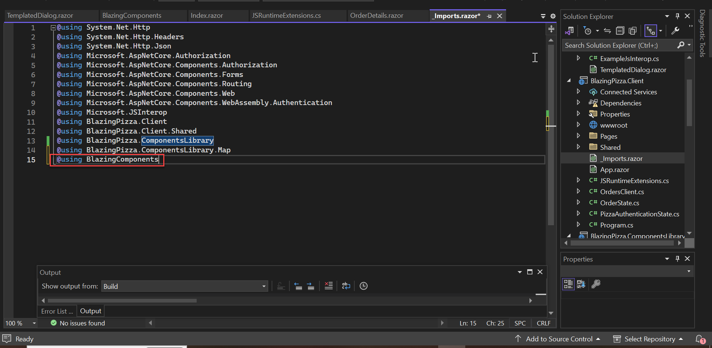

## Task 4: Another refactor

Recall that our `TemplatedDialog` contains a few `div`s. Well, this duplicates some of the structure of `ConfigurePizzaDialog`. Let's clean that up. Open `ConfigurePizzaDialog.razor` in the `Shared` folder of the client project.

We should remove the outermost two layers of `div` elements since those are now part of the `TemplatedDialog` component. After removing these it should look more like:

```html
<div class="dialog-title">
            <h2>@Pizza.Special?.Name</h2>
            @Pizza.Special?.Description
        </div>
        <form class="dialog-body">
            <div>
                <label>Size:</label>
                <input type="range" min="@Pizza.MinimumSize" max="@Pizza.MaximumSize" step="1" @bind="Pizza.Size" @bind:event="oninput" />
                <span class="size-label">
                    @(Pizza.Size)" (£@(Pizza.GetFormattedTotalPrice()))
                </span>
            </div>
            <div>
                <label>Extra Toppings:</label>
                @if (toppings is null)
                {
                    <select class="custom-select" disabled>
                        <option>(loading...)</option>
                    </select>
                }
                else if (Pizza.Toppings.Count >= 6)
                {
                    <div>(maximum reached)</div>
                }
                else
                {
                    <select class="custom-select" @onchange="ToppingSelected">
                        <option value="-1" disabled selected>(select)</option>
                        @for (var i = 0; i < toppings.Count; i++)
                        {
                            <option value="@i">@toppings[i].Name - (£@(toppings[i].GetFormattedPrice()))</option>
                        }
                    </select>
                }
            </div>

            <div class="toppings">
                @foreach (var topping in Pizza.Toppings)
                {
                    if (topping?.Topping is not null)
                    {
                        <div class="topping">
                            @topping.Topping.Name
                            <span class="topping-price">@topping.Topping.GetFormattedPrice()</span>
                            <button type="button" class="delete-topping" @onclick="@(() => RemoveTopping(topping.Topping))">x</button>
                        </div>
                    }
                }
            </div>
        </form>

        <div class="dialog-buttons">
            <button class="btn btn-secondary mr-auto" @onclick="OnCancel">Cancel</button>
            <span class="mr-center">
                Price: <span class="price">@(Pizza.GetFormattedTotalPrice())</span>
            </span>
            <button class="btn btn-success ml-auto" @onclick="OnConfirm">Order ></button>
        </div>
```

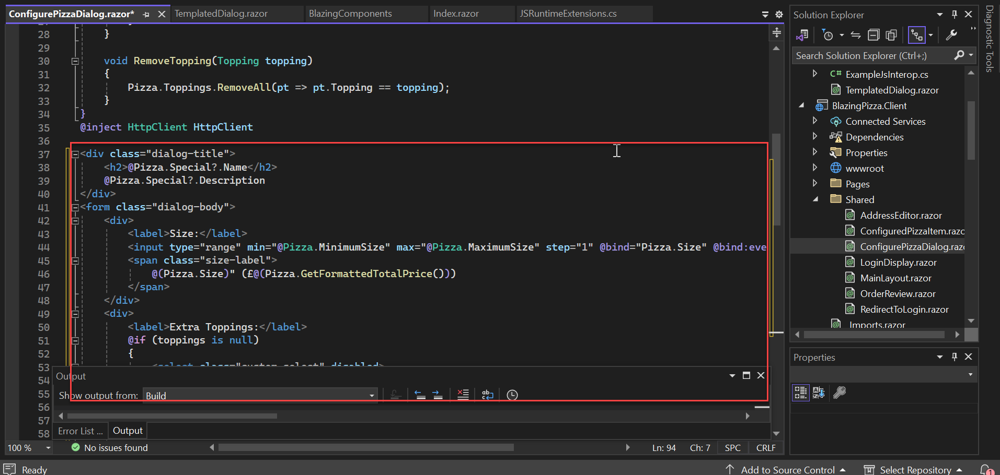

## Task 5: Using the new dialog

We'll use this new templated component from `Index.razor`. Open `Index.razor` and find the block of code that looks like:

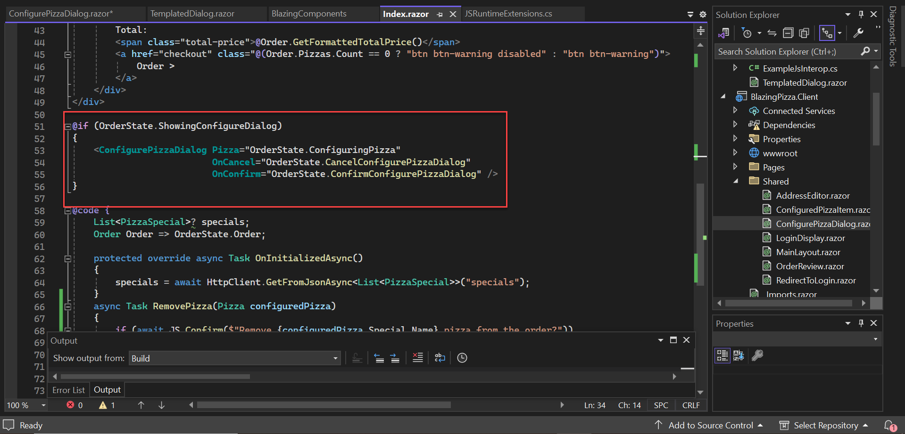

We are going to remove this and replace it with an invocation of the new component. Replace the block above with the following:

```html
<TemplatedDialog Show="OrderState.ShowingConfigureDialog">
    <ConfigurePizzaDialog 
        Pizza="OrderState.ConfiguringPizza" 
        OnCancel="OrderState.CancelConfigurePizzaDialog" 
        OnConfirm="OrderState.ConfirmConfigurePizzaDialog" />
</TemplatedDialog>
```

This is wiring up our new `TemplatedDialog` component to show and hide itself based on `OrderState.ShowingConfigureDialog`. Also, we're passing in some content to the `ChildContent` parameter. Since we called the parameter `ChildContent` any content that is placed inside the `<TemplatedDialog> </TemplatedDialog>` will be captured by a `RenderFragment` delegate and passed to `TemplatedDialog`. 

>**Note:** A templated component may have multiple `RenderFragment` parameters. What we're showing here is a convenient convention when the caller wants to provide a single `RenderFragment` that represents the *main* content.

At this point it should be possible to run the code and see that the new dialog works correctly. Verify that this is working correctly before moving on to the next step.

## Task 6: A more advanced templated component

Now that we've done a basic templated dialog, we're going to try something more sophisticated. Recall that the `MyOrders.razor` page shows a list of orders, but it also contains three-state logic (loading, empty list, and showing items). If we could extract that logic into a reusable component, would that be useful? Let's give it a try.

Start by creating a new razor file called `TemplatedList.razor` in the `BlazingComponents` project. We want this list to have a few features:

- Async-loading of any type of data

- Separate rendering logic for three states - loading, empty list, and showing items

We can solve async loading by accepting a delegate of type `Func<Task<IEnumerable<?>>>` - we need to figure out what type should replace **?**. Since we want to support any kind of data, we need to declare this component as a generic type. We can make a generic-typed component using the `@typeparam` directive, so place this at the top of `TemplatedList.razor`.

```html
@typeparam TItem
```

Making a generic-typed component works similarly to other generic types in C#, in fact `@typeparam` is just a convenient Razor syntax for a generic .NET type.

> Note: We don't yet have support for type-parameter-constraints. This is something we're looking to add in the future.

Now that we've defined a generic type parameter we can use it in a parameter declaration. Let's add a parameter to accept a delegate we can use to load data, and then load the data in a similar fashion to our other components. Add the following to the file's `@code` block.

```csharp
IEnumerable<TItem> items;

[Parameter] public Func<Task<IEnumerable<TItem>>> Loader { get; set; }

protected override async Task OnParametersSetAsync()
{
    items = await Loader();
}
```

Since we have the data, we can now add the structure of each of the states we need to handle. Add the following markup above the `@code` block of `TemplatedList.razor`:

```html
@if (items == null)
{

}
else if (!items.Any())
{
}
else
{
    <div class="list-group">
        @foreach (var item in items)
        {
            <div class="list-group-item">
                
            </div>
        }
    </div>
}
```

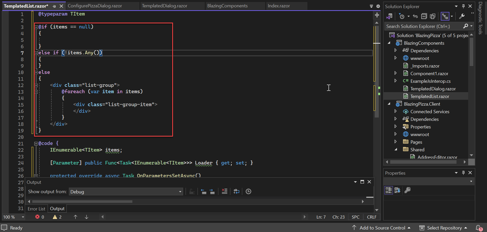

Now, these are our three states of the dialog, and we'd like to accept a content parameter for each one so the caller can plug in the desired content. We do this by defining three `RenderFragment` parameters. Since we have multiple `RenderFragment` parameters we'll just give each one their own descriptive names instead of calling them `ChildContent`. The content for showing an item needs to take a parameter. We can do this by using `RenderFragment<T>`.

Add the below parameters to the `@code` block. 

```C#
[Parameter] public RenderFragment Loading{ get; set; }
[Parameter] public RenderFragment Empty { get; set; }
[Parameter] public RenderFragment<TItem> Item { get; set; }
```


Now that we have some `RenderFragment` parameters, we can start using them. Update the markup we created earlier to plug in the correct parameter in each place.

```html
@if (items == null)
{
    @Loading
}
else if (!items.Any())
{
    @Empty
}
else
{
    <div class="list-group">
        @foreach (var item in items)
        {
            <div class="list-group-item">
                @Item(item)
            </div>
        }
    </div>
}
```

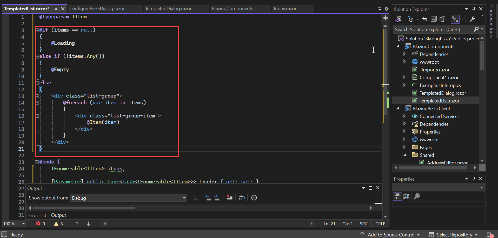

The `Item` accepts a parameter, and the way to deal with this is just to invoke the function. The result of invoking a `RenderFragment<T>` is another `RenderFragment` which can be rendered directly.

The new component should compile at this point, but there's still one thing we want to do. We want to be able to style the `<div class="list-group">` with another class, since that's what `MyOrders.razor` is doing. Adding small extensibiliy points to plug in additional css classes can go a long way for reusability.

Let's add another `string` parameter, and finally the functions block of `TemplatedList.razor` should look like:

```csharp
[Parameter] public string ListGroupClass { get; set; }
```

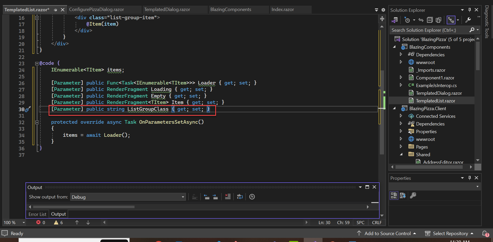

Lastly update the line `<div class="list-group">` to contain `<div class="list-group @ListGroupClass">`. 

```html
<div class="list-group @ListGroupClass">
```

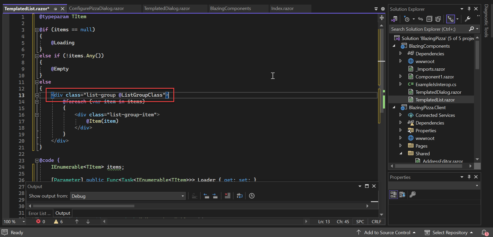

## Task 7: Using TemplatedList

To use the new `TemplatedList` component, we're going to edit `MyOrders.razor` in the `Pages` folder of the client project.

First, we need to create a delegate that we can pass to the `TemplatedList` that will load order data. We can do this by keeping the code that's in `MyOrders.OnParametersSetAsync` and changing the method signature. The `@code` block should look like this:

```html
@code {
    async Task<IEnumerable<OrderWithStatus>> LoadOrders()
    {
        var ordersWithStatus = Enumerable.Empty<OrderWithStatus>();
        try
        {
            ordersWithStatus = await OrdersClient.GetOrders();
        }
        catch (AccessTokenNotAvailableException ex)
        {
            ex.Redirect();
        }
        return ordersWithStatus;
    }
}
```

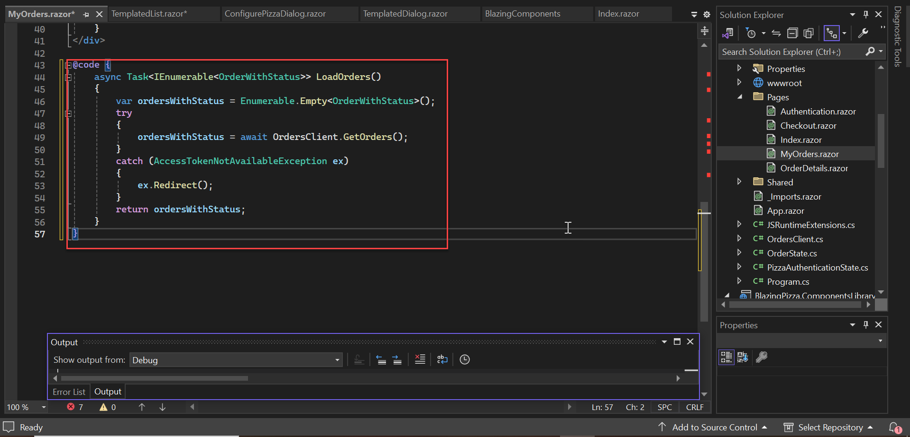

This matches the signature expected by the `Loader` parameter of `TemplatedList`, it's a `Func<Task<IEnumerable<?>>>` where the **?** is replaced with `OrderWithStatus` so we are on the right track.

You can use the `TemplatedList` component now like so by replacing the contents of the `<div class="main">` block with the following: 

```html
<TemplatedList>
</TemplatedList>
```

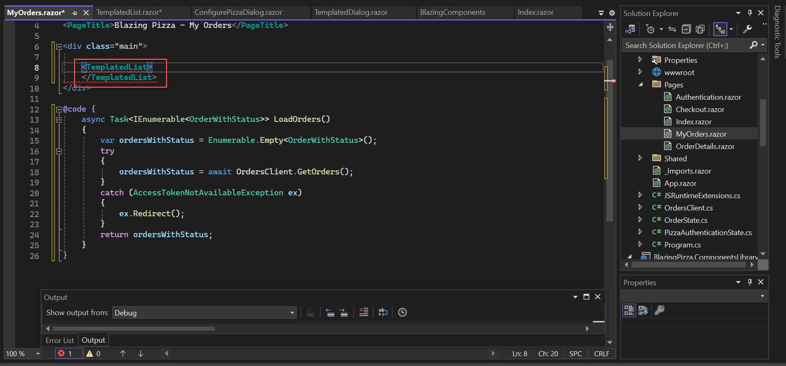

The compiler will complain about not knowing the generic type of `TemplatedList`. The compiler is smart enough to perform type inference like normal C# but we haven't given it enough information to work with.

Adding the `Loader` attribute should fix the issue.

```html
<TemplatedList Loader="LoadOrders">
```

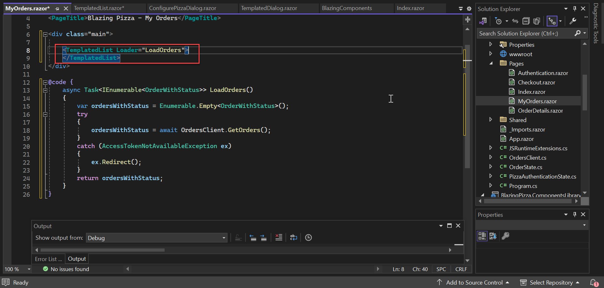

Next, we need to think about how to pass multiple content (`RenderFragment`) parameters to a component. We've learned using `TemplatedDialog` that a single `[Parameter] RenderFragment ChildContent` can be set by nesting content inside the component. However this is just a convenient syntax for the most simple case. When you want to pass multiple content parameters, you can do this by nesting elements inside the component that match the parameter names.

For our `TemplatedList` here's an example that sets each parameter to some dummy content:

```html
<div class="main">
    <TemplatedList Loader="LoadOrders">
        <Loading>Hi there!</Loading>
        <Empty>
            How are you?
        </Empty>
        <Item>
            Are you enjoying Blazor?
        </Item>
    </TemplatedList>
</div>
```

The `Item` parameter is a `RenderFragment<T>` - which accepts a parameter. By default this parameter is called `context`. If we type inside of `<Item>  </Item>` then it should be possible to see that `@context` is bound to a variable of type `OrderStatus`. We can rename the parameter by using the `Context` attribute:

```html
<div class="main">
    <TemplatedList Loader="LoadOrders">
        <Loading>Hi there!</Loading>
        <Empty>
            How are you?
        </Empty>
        <Item Context="item">
            Are you enjoying Blazor?
        </Item>
    </TemplatedList>
</div>
```

Now we want to include all of the existing content from `MyOrders.razor`, so putting it all together should look more like the following:

```html
<div class="main">
    <TemplatedList Loader="LoadOrders" ListGroupClass="orders-list">
        <Loading>Loading...</Loading>
        <Empty>
            <h2>No orders placed</h2>
            <a class="btn btn-success" href="">Order some pizza</a>
        </Empty>
        <Item Context="item">
            <div class="col">
                <h5>@item.Order.CreatedTime.ToLongDateString()</h5>
                Items:
                <strong>@item.Order.Pizzas.Count()</strong>;
                Total price:
                <strong>£@item.Order.GetFormattedTotalPrice()</strong>
            </div>
            <div class="col">
                Status: <strong>@item.StatusText</strong>
            </div>
            <div class="col flex-grow-0">
                <a href="myorders/@item.Order.OrderId" class="btn btn-success">
                    Track &gt;
                </a>
            </div>
        </Item>
    </TemplatedList>
</div>
```

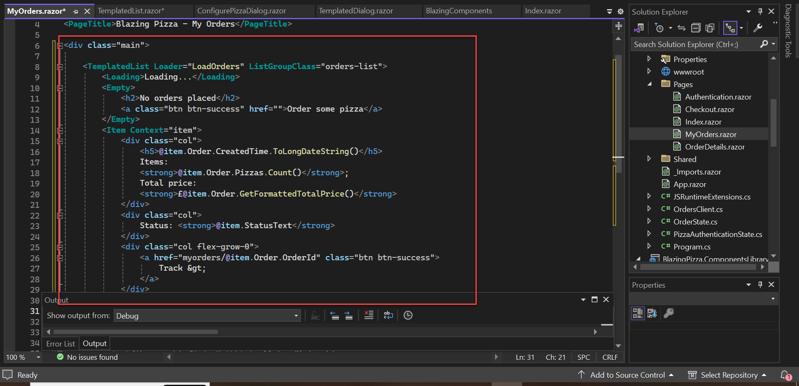

Notice that we're also setting the `ListGroupClass` parameter to add the additional styling that was present in the original `MyOrders.razor`. 

There were a number of steps and new features to introduce here. Run this and make sure that it works correctly now that we're using the templated list.

To prove that the list is really working correctly we can try the following: 

1. Delete the `pizza.db` from the `Blazor.Server` project to test the case where there are no orders

2. Add an `await Task.Delay(3000);` to `LoadOrders` (also marking that method as `async`) to test the case where we're still loading

## Summary

So what have we seen in this session?

- It's possible to write components that accept *content* as a parameter - even multiple content parameters

- Templated components can be used to abstract things, like showing a dialog, or async loading of data

- Components can be generic types, which makes them more reusable

