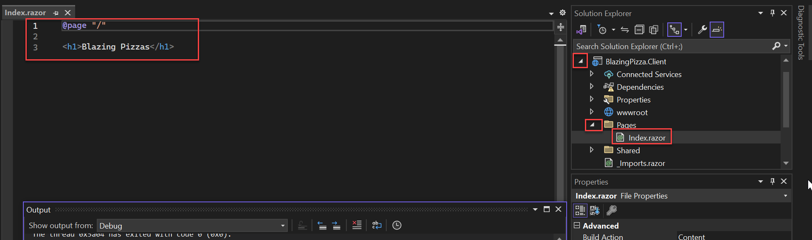

# エクササイズ 1: コンポーネントとレイアウト

このエクササイズでは、Blazor を使用してピザ注文アプリの作成を開始します。このアプリを使って、ユーザーがピザを注文し、カスタマイズし、配達状況を追跡できるようにします。

## タスク 1: サンプルアプリのダウンロードと実行

コンピューターに「BlazingPizza」という名前の新しいフォルダを作成し、そのフォルダに[ピザストアサンプルアプリ](https://opsgilitylabs.blob.core.windows.net/pizzastore.zip)をダウンロードして解凍します。「Visual Studio 2022」でソリューションを開きます。

このソリューションには、次の 4 つのプロジェクトが含まれています：

  * `BlazingPizza.Client`: Blazor プロジェクトで、アプリの UI コンポーネントが含まれています。
  * `BlazingPizza.Server`: ASP.NET Core プロジェクトで、Blazor アプリをホストし、バックエンドサービスも提供します。
  * `BlazingPizza.Shared`: アプリで使用する共通のモデルタイプが含まれています。
  * `BlazingPizza.ComponentsLibrary`: 後のセッションで使用するコンポーネントとヘルパーコードのライブラリです。

`BlazingPizza.Server` プロジェクトをスタートアッププロジェクトに設定します。

アプリを実行すると（Visual Studio の上部にある緑色の `IIS Express` 再生ボタンをクリック）、現在はシンプルなホームページのみが表示されるはずです。


デバッグを停止し、`BlazingPizza.Client` プロジェクトを展開します。次に `Pages` フォルダを展開し、`Index.razor` をクリックしてホームページのコードを確認します。



このホームページは単一のコンポーネントとして実装されています。`@page` ディレクティブは、`Index` コンポーネントが指定されたルートでアクセスできるページであることを示します。

## タスク 2: ピザスペシャルのリストを表示する

まず、ホームページを更新して利用可能なピザスペシャルのリストを表示します。このリストは `Index` コンポーネントの状態の一部になります。

次の `@code` ブロックを `Index.razor` に追加し、利用可能なスペシャルを追跡するリストフィールドを追加します：

```razor
@code {
    List<PizzaSpecial> specials;
}
```

`@code` ブロックに追加されたコードは、コンポーネントの生成されたクラスに含まれます。`PizzaSpecial` 型は `BlazingPizza.Shared` プロジェクト内で定義済みです。

バックエンドの API を呼び出してスペシャルのリストを取得するために、依存性注入で `HttpClient` をインジェクトします。`@inject` ディレクティブを使用して `HttpClient` を `Index` コンポーネントに注入します。

次のコードを `@page "/"` ディレクティブの直下に追加します：

```razor
@inject HttpClient HttpClient
```

`@inject` ディレクティブは、指定されたプロパティタイプと名前で新しいプロパティを定義します。このプロパティは依存性注入を通じて設定されます。

`OnInitializedAsync` メソッドをオーバーライドして、ピザスペシャルのリストを取得します。以下のコードで `@code` ブロック全体を置き換えます：

```razor
@code {
    List<PizzaSpecial> specials;

    protected override async Task OnInitializedAsync() {
        specials = await HttpClient.GetFromJsonAsync<List<PizzaSpecial>>("specials", BlazingPizza.OrderContext.Default.ListPizzaSpecial);
    }
}
```

このメソッドはコンポーネントのライフサイクルの一部であり、コンポーネントが初期化されると呼び出されます。`GetFromJsonAsync<T>()` メソッドを使用して JSON のデシリアライズを処理します：

API エンドポイント `/specials` は `BlazingPizza.Server` プロジェクト内の `PizzaApiExtensions.cs` で定義されています。

> `注:` `BlazingPizza.OrderContext.Default.ListPizzaSpecial` は、[ソースジェネレータ](https://docs.microsoft.com/ja-jp/dotnet/csharp/roslyn-sdk/source-generators-overview)を使用した JSON シリアル化を指します。

コンポーネントが初期化されると、マークアップがレンダリングされます。以下のコードで `<h1>Blazing Pizzas</h1>` の行を置き換え、ピザスペシャルのリストを表示します：

```razor
<div class="main">
    <ul class="pizza-cards">
        @if (specials != null) {
            @foreach (var special in specials) {
                <li style="background-image: url('@special.ImageUrl')">
                    <div class="pizza-info">
                        <h3>@special.Name</h3>
                        <p>@special.Description</p>
                    </div>
                    <span class="price">@special.BasePrice.ToString("C")</span>
                </li>
            }
        }
    </ul>
</div>
```

これで、アプリを再実行すると、利用可能なピザスペシャルの一覧がホームページに表示されるはずです。
