# エクササイズ 2: ピザをカスタマイズする

このエクササイズでは、ピザ注文アプリを更新して、ユーザーがピザをカスタマイズし、注文に追加できるようにします。

## タスク 1: イベントハンドリング

ユーザーがピザスペシャルをクリックすると、ピザカスタマイズダイアログが表示され、ユーザーがピザをカスタマイズして注文に追加できるようにします。

`Index.razor` に各ピザスペシャルのリストアイテムに対する `@onclick` ハンドラーを追加します。

```razor
@onclick="@(() => Console.WriteLine(special.Name))"
```

変更後のコードは次のようになります。

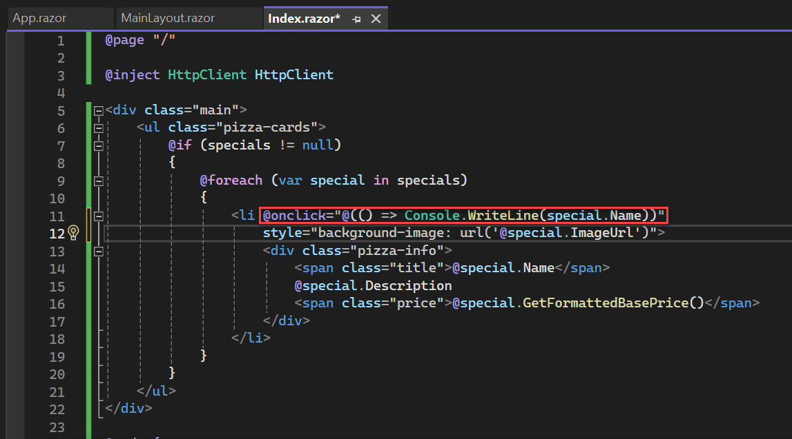

アプリを実行し、ブラウザコンソールにピザ名が表示されることを確認します。

> コンソールを表示するには `CTRL + SHIFT + I` を押します。

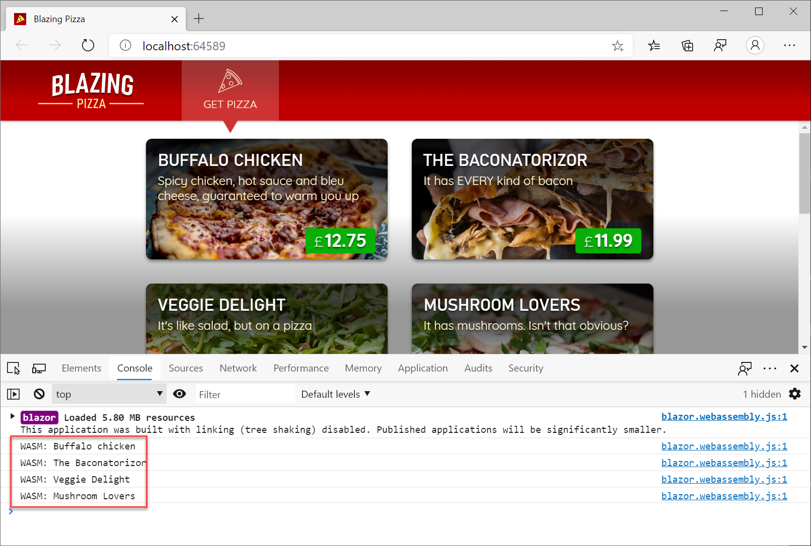

`@code` ブロックにカスタマイズ中のピザを追跡するフィールドとダイアログの表示状態を追加します。

```csharp
Pizza configuringPizza;
bool showingConfigureDialog;
```


`ShowConfigurePizzaDialog` メソッドを `@code` ブロックに追加し、ピザスペシャルがクリックされたときに処理します。

```csharp
void ShowConfigurePizzaDialog(PizzaSpecial special) {
    configuringPizza = new Pizza() {
        Special = special,
        SpecialId = special.Id,
        Size = Pizza.DefaultSize,
        Toppings = new List<Topping>(),
    };
    showingConfigureDialog = true;
}
```

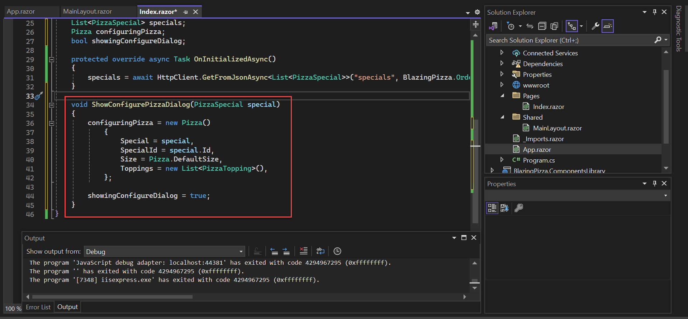

`@onclick` ハンドラーを `ShowConfigurePizzaDialog` メソッドを呼び出すように更新します。

```html
<li @onclick="(() => ShowConfigurePizzaDialog(special))">
```

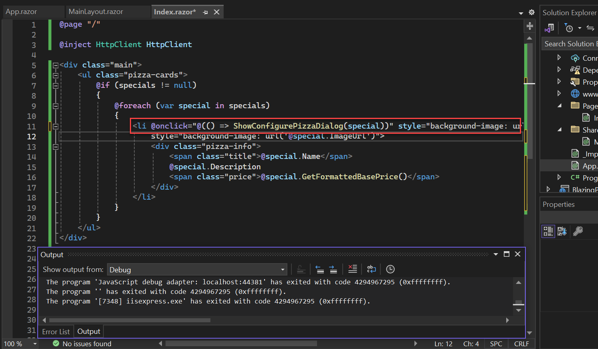

## タスク 2: ピザカスタマイズダイアログの実装

ユーザーがピザを選択したときに表示するカスタマイズダイアログを作成します。`Shared` フォルダに `ConfigurePizzaDialog.razor` ファイルを追加します。

1. `Shared` フォルダを右クリックし、「Add」→「Razor Component」をクリックします。

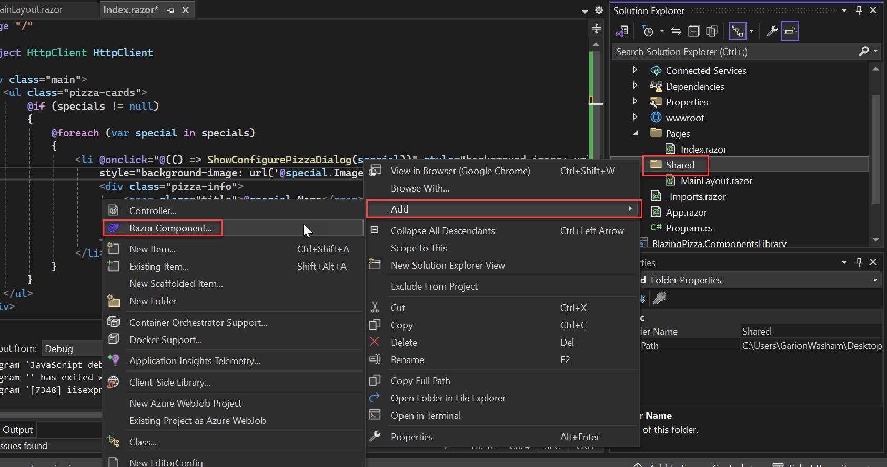

2. ファイル名を `ConfigurePizzaDialog.razor` に設定し、「Add」をクリックします。

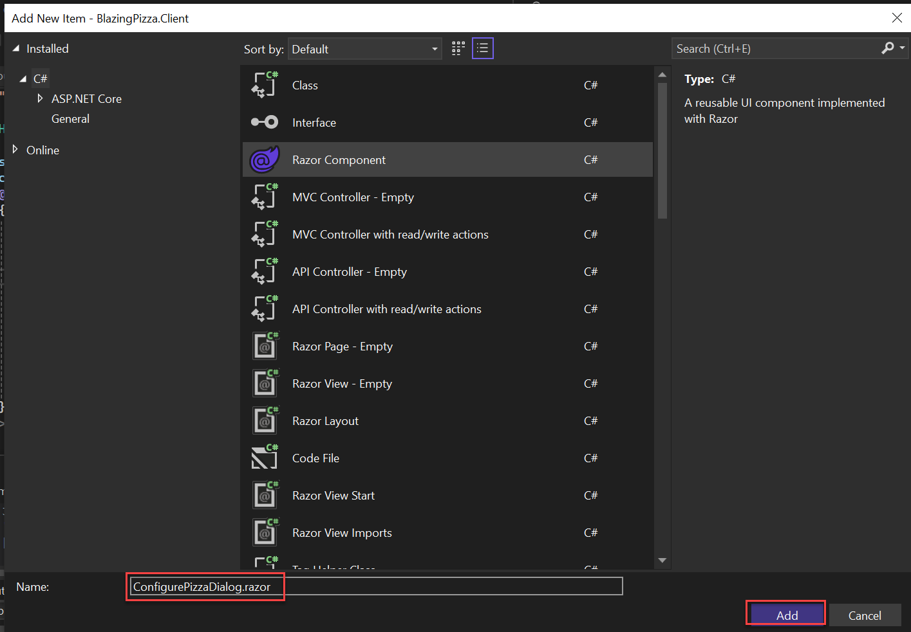

ダイアログで設定するピザを指定する `Pizza` パラメータを追加します。

```csharp
@code {
    [Parameter]
    public Pizza Pizza { get; set; }
}
```

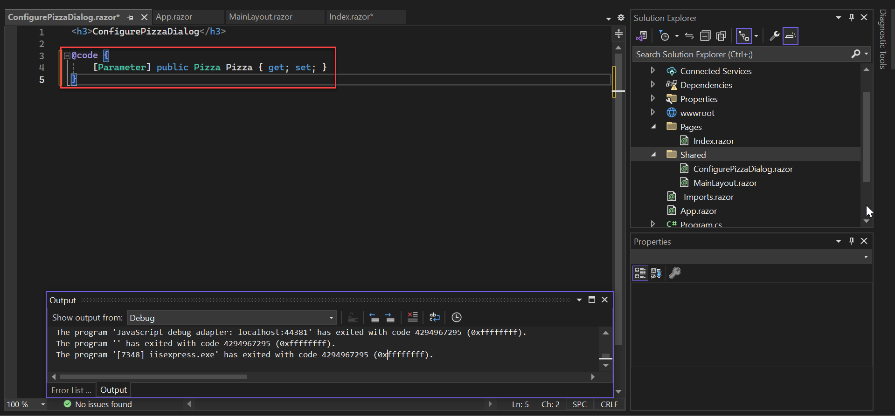

次の基本的なマークアップを `ConfigurePizzaDialog.razor` に追加します。

```html
<h2>@Pizza.Special.Name</h2>
<p>@Pizza.Special.Description</p>
<button @onclick="() => showingConfigureDialog = false">Cancel</button>
```

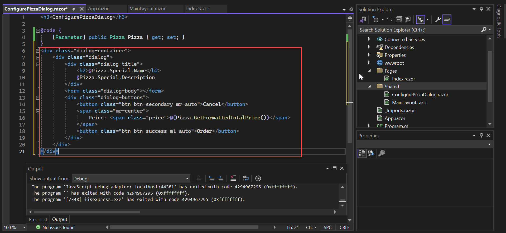

`Index.razor` に戻り、ピザスペシャルが選択されたときに `ConfigurePizzaDialog` を表示するように更新します。

```html
@if (showingConfigureDialog) {
    <ConfigurePizzaDialog Pizza="configuringPizza" />
}
```

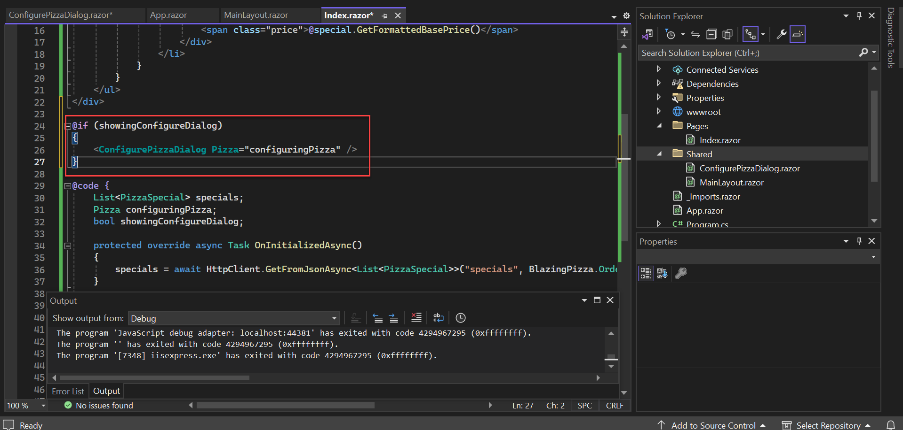

アプリを実行し、ピザスペシャルを選択すると、`ConfigurePizzaDialog` のスケルトンが表示されます。

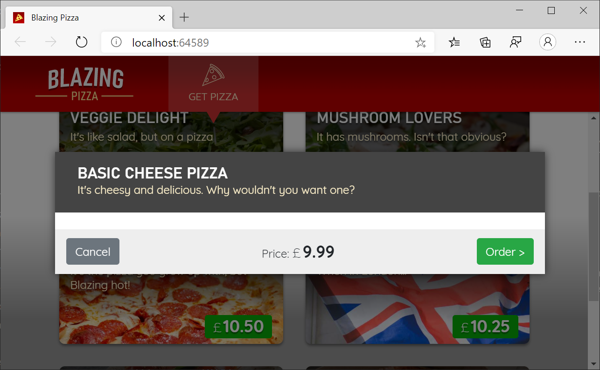

## タスク 3: データバインディング

ユーザーがピザのサイズを指定できるようにします。スライダーを追加してピザサイズを変更できるようにします。

```html
<input type="range" min="1" max="20" step="1" value="@Pizza.Size" @oninput="(e) => Pizza.Size = int.Parse(e.Value.ToString())" />
```

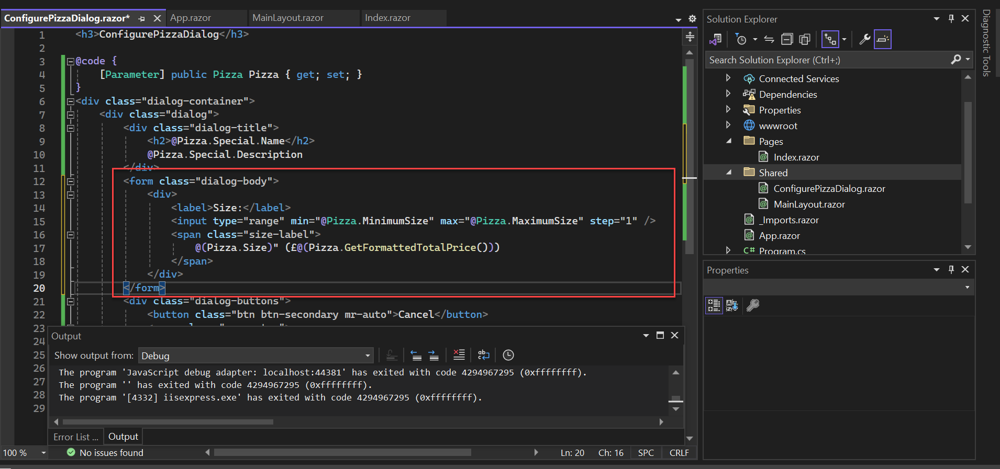

スライダーを動かすとピザサイズが更新されるようになりました。

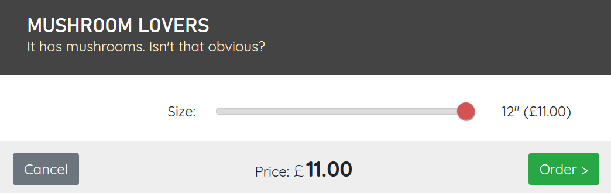

## タスク 4: トッピングの追加

カスタマイズダイアログで追加トッピングを選択できるようにします。利用可能なトッピングを取得してリスト表示します。

1. `ConfigurePizzaDialog.razor` に `HttpClient` をインジェクトします。

```razor
@inject HttpClient HttpClient
```

2. トッピングを取得するために `OnInitializedAsync` を上書きします。

```csharp
@code {
    List<Topping> toppings;

    [Parameter]
    public Pizza Pizza { get; set; }

    protected override async Task OnInitializedAsync() {
        toppings = await HttpClient.GetFromJsonAsync<List<Topping>>("toppings");
    }
}
```

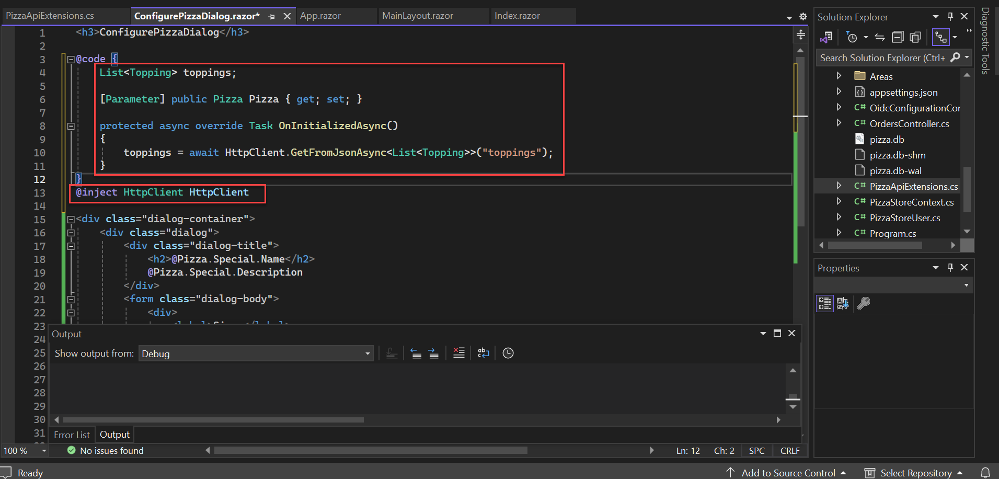

トッピングのリストと選択されたトッピングを表示するマークアップを追加します。

```html
<select @onchange="ToppingSelected">
    @foreach (var topping in toppings) {
        <option value="@topping.Id">@topping.Name - @topping.Price</option>
    }
</select>

@foreach (var topping in Pizza.Toppings) {
    <span>@topping.Name</span>
}
```

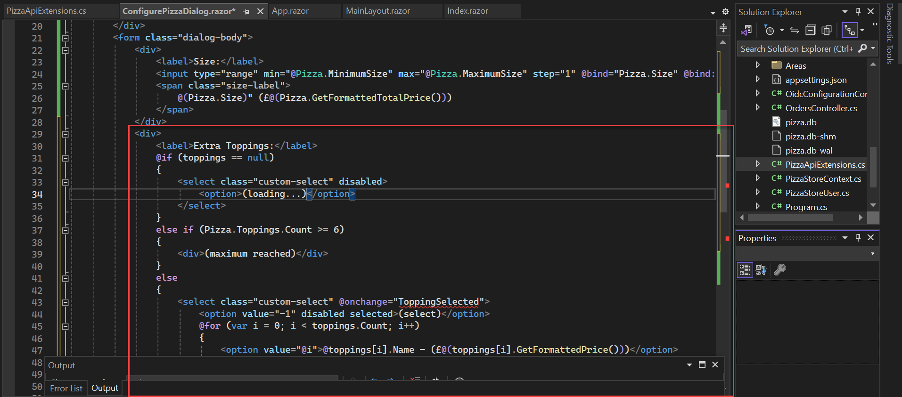

次のイベントハンドラを追加します。

```csharp
void ToppingSelected(ChangeEventArgs e) {
    var toppingId = int.Parse(e.Value.ToString());
    var topping = toppings.FirstOrDefault(t => t.Id == toppingId);
    if (topping != null) {
        Pizza.Toppings.Add(topping);
    }
}
```

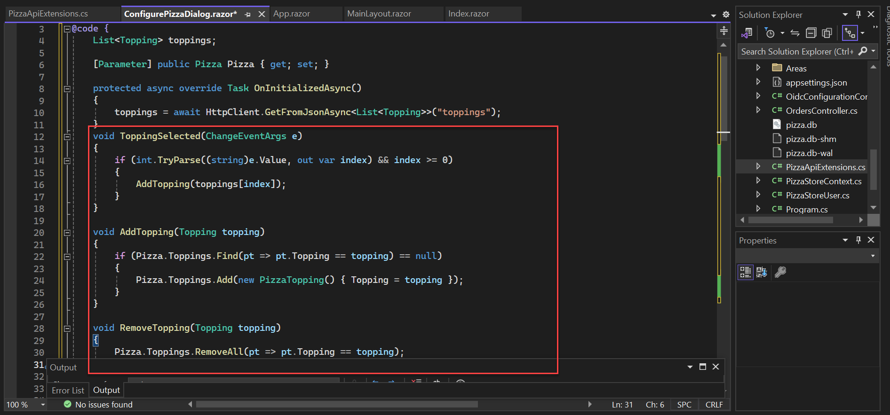

アプリを実行すると、トッピングを追加できるようになります。


