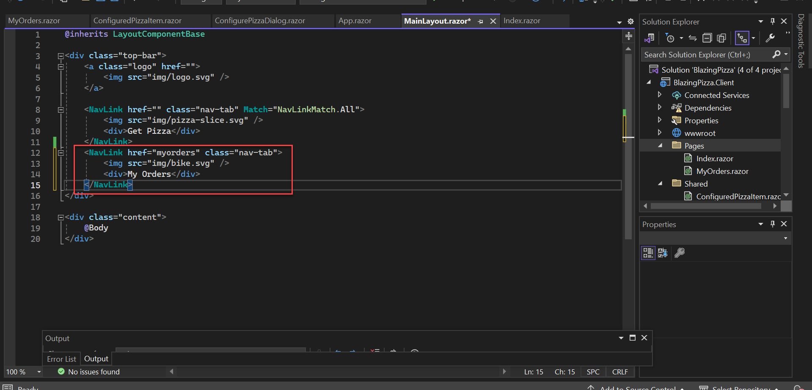

# エクササイズ 3: 注文状況の表示

お客様がピザを注文できるようになりましたが、現状では注文状況を確認する手段がありません。このエクササイズでは、複数の注文をリスト表示する「My Orders」ページと、個々の注文内容とステータスを表示する「Order Details」ビューを実装します。

## タスク 1: ナビゲーションリンクの追加

`BlazingPizza.Client` プロジェクトの `Shared` フォルダ内にある `MainLayout.razor` を開きます。`NavLink` コンポーネントを使用せずに、新しいリンク要素を追加してみましょう。`NavLink` 要素の下にプレーンな HTML の `<a>` タグで `myorders` へのリンクを追加します。

```html
<a href="myorders">My Orders</a>
```


リンク先の URL がスラッシュ (`/`) で始まらないことに注意してください。`/myorders` にリンクしても同じように動作しますが、アプリをルート URL 以外に配置する場合、リンクが壊れる可能性があります。`index.html` の `<base>` タグが、アプリ内のスラッシュで始まらないすべての URL にプレフィックスを指定しています。

アプリを実行すると、リンクが表示され、予想通りにスタイルが適用されます。


`NavLink` を使用する必要はないことがわかりますが、理由は後で説明します。

## タスク 2: 「My Orders」ページの追加

`My Orders` をクリックすると、`Sorry, there's nothing at this address.` と表示されるページに遷移します。これは、まだ `myorders` に一致するコンポーネントを追加していないためです。リンクが機能するようにするために、このルートに一致するコンポーネントを追加します。

`Solution Explorer` で `Pages` フォルダを右クリックし、「Add」→「Razor Component」を選択します。ファイル名を `MyOrders.razor` に設定して「Add」をクリックします。次の内容を追加します。

```html
@page "/myorders"

<div>
    My orders will go here
</div>
```

アプリを実行し、`My Orders` をクリックすると、このページに遷移します。


## タスク 3: ページタイトルの追加

ブラウザで新しいページのタイトルが「Blazing Pizza」と表示されていますが、`My Orders` ページに反映するように更新しましょう。次の行を `@page "/myorders"` の下に追加します。

```html
<title>Blazing Pizza - My Orders</title>
```


## タスク 4: ナビゲーション位置のハイライト表示

`My Orders` ページにいるときにリンクがハイライト表示されるようにします。`NavLink` コンポーネントを使うと、リンクの `href` が現在のナビゲーション状態に一致する場合に `active` CSS クラスがトグルされます。先ほど追加した `<a>` タグを次のように置き換えます。

```html
<NavLink href="myorders">My Orders</NavLink>
```



## タスク 5: 注文リストの表示

`MyOrders.razor` ファイルに戻り、データを取得するために `HttpClient` をインジェクトします。`@page` ディレクティブの下に次を追加します。

```razor
@inject HttpClient HttpClient
```

`@code` ブロックを追加し、非同期リクエストを作成してデータを取得します。

```csharp
@code {
    IEnumerable<OrderWithStatus> ordersWithStatus;

    protected override async Task OnParametersSetAsync() {
        ordersWithStatus = await HttpClient.GetFromJsonAsync<List<OrderWithStatus>>("orders");
    }
}
```

注文が存在しない場合やデータを読み込み中の場合の UI 表示を、`@if/else` ブロックを使用して作成します。`MyOrders.razor` 内の `div` 要素を次のコードに置き換えます。

```html
<div>
    @if (ordersWithStatus == null) {
        <p><em>Loading...</em></p>
    } else if (!ordersWithStatus.Any()) {
        <p><strong>No orders placed</strong></p>
        <p>Order some pizza</p>
    } else {
        TODO: show orders
    }
</div>
```


## 注文リストのレンダリング

データを取得できるようになったので、HTML グリッドをレンダリングします。`TODO: show orders` を次のコードに置き換えます。

```html
<div class="orders">
    @foreach (var item in ordersWithStatus) {
        <div class="order-summary">
            <h5>@item.Order.CreatedTime.ToLongDateString()</h5>
            <p>Items: @item.Order.Pizzas.Count()</p>
            <p>Total price: $@item.Order.GetFormattedTotalPrice()</p>
            <p>Status: @item.StatusText</p>
            <NavLink href="myorders/@item.Order.OrderId">Track >></NavLink>
        </div>
    }
</div>
```


## タスク 6: 注文詳細の表示

「Track」リンクボタンをクリックすると、ブラウザが `myorders/` へ遷移しますが、現在は一致するコンポーネントがないため、`Sorry, there's nothing at this address.` と表示されます。`Pages` フォルダに `OrderDetails.razor` ファイルを作成し、次のコードを追加します。

```html
@page "/myorders/{orderId:int}"
<div>
    TODO: Show details for order @{orderId}
</div>
```
