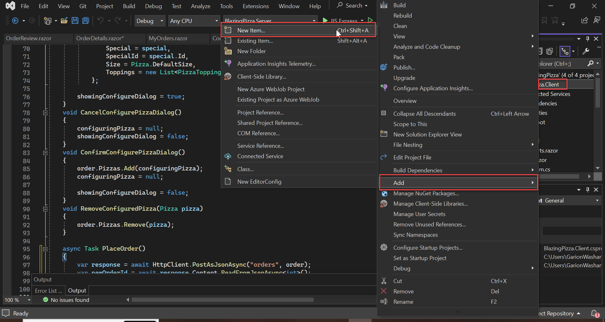
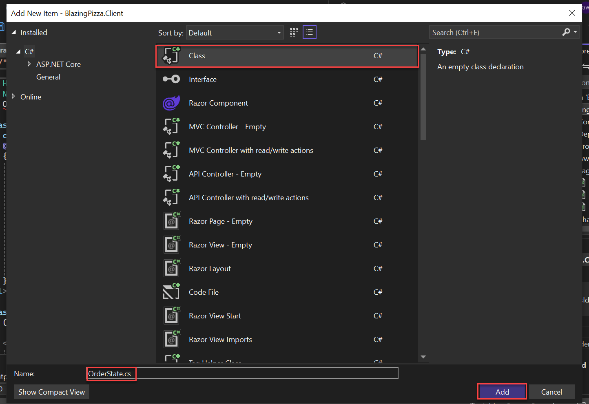
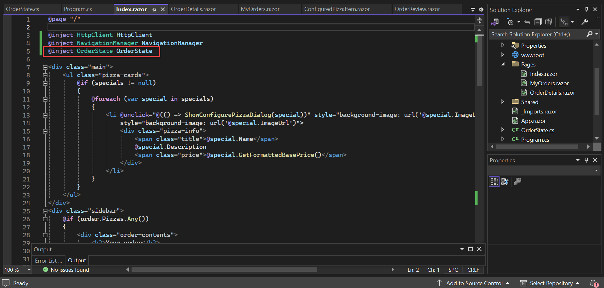
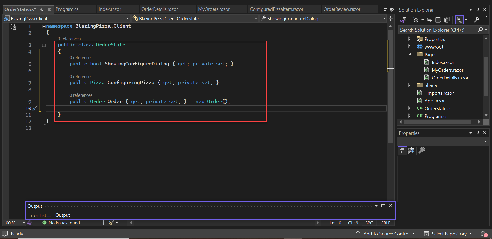
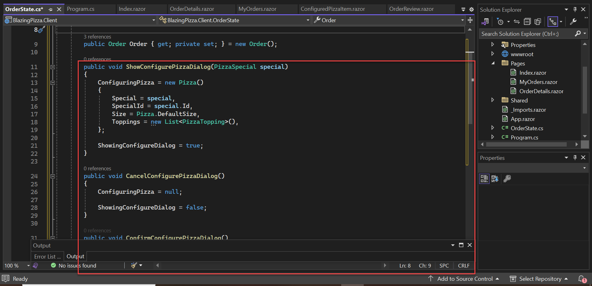
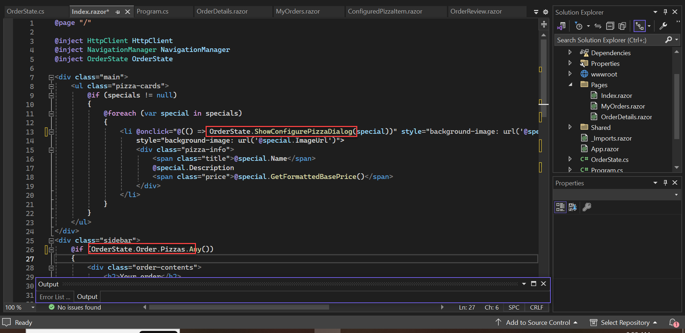

# エクササイズ 4: 状態管理のリファクタリング

このエクササイズでは、これまでに書いたコードを改善し、イベントと UI の更新方法についても詳しく説明します。

## 問題点

すでに気付いたかもしれませんが、アプリにはバグがあります！現在、注文中のピザのリストを `Index` コンポーネントで保持していますが、ユーザーが `Index` ページを離れると状態が失われてしまいます。ピザを追加して注文を開始しても（注文を確定せずに）、`MyOrders` ページに移動して `Index` ページに戻ると、注文が空になってしまいます。

## 解決方法

このバグを修正するために、「AppState パターン」と呼ばれる方法を導入します。*AppState パターン* は、DI コンテナに追加されたオブジェクトを使用して、関連するコンポーネント間の状態を調整します。*AppState* オブジェクトは DI コンテナによって管理され、コンポーネントよりも長く保持されるため、UI が変わっても状態を保持できます。また、*AppState パターン* により、プレゼンテーション（コンポーネント）とビジネスロジックの分離が強化されます。

## タスク 1: 準備

`OrderState` という新しいクラスを `Client` プロジェクトのルートディレクトリに作成します。`BlazingPizza.client` を右クリックし、「Add」→「New item」を選択します。



`Class` を選択し、ファイル名を `OrderState.cs` に設定します。



このクラスを DI コンテナにスコープされたサービスとして登録します。Blazor WebAssembly アプリケーションでは、サービスは `Program` クラスに登録します。`await builder.Build().RunAsync();` の直前にサービスを追加します。`Program.cs` ファイルの内容を次のように置き換えます。

```csharp
using BlazingPizza.Client;
using Microsoft.AspNetCore.Components.Web;
using Microsoft.AspNetCore.Components.WebAssembly.Hosting;

var builder = WebAssemblyHostBuilder.CreateDefault(args);
builder.RootComponents.Add("#app");
builder.RootComponents.Add("head::after");

builder.Services.AddScoped(sp => new HttpClient { BaseAddress = new Uri(builder.HostEnvironment.BaseAddress) });
builder.Services.AddScoped<OrderState>();

await builder.Build().RunAsync();
```

> `Note:` スコープをシングルトンではなくスコープとして選択した理由は、サーバーサイドコンポーネントアプリケーションとの対称性のためです。シングルトンは通常「すべてのユーザー用」を意味し、スコープは「現在のユニット・オブ・ワーク用」を意味します。

## `Index` の更新

この型が DI に登録されたので、`Index` ページに `@inject` でインジェクトします。`Index.razor` ファイルに次のディレクティブを追加します。

```razor
@inject OrderState OrderState
```



`@inject` は、DI から型によってオブジェクトを取得し、その型のプロパティを定義するための便利な短縮方法です。アプリを再度実行して、DI コンテナに見つからないものをインジェクトしようとすると、例外が発生し、`Index` ページが表示されなくなります。

次に、このクラスにプロパティとメソッドを追加して、`Order` と `Pizza` の状態を表し、操作できるようにします。`configuringPizza`、`showingConfigureDialog`、および `order` フィールドを `OrderState` クラスのプロパティに移動します。これらを `private set` として、`OrderState` のメソッドを介してのみ操作できるようにします。

```csharp
public class OrderState {
    public bool ShowingConfigureDialog { get; private set; }
    public Pizza ConfiguringPizza { get; private set; }
    public Order Order { get; private set; } = new Order();
}
```



次に、`Index` のメソッドの一部を `OrderState` に移動します。`PlaceOrder` はナビゲーションをトリガーするため、`OrderState` には移動せず、代わりに `ResetOrder` メソッドを追加します。

```csharp
public void ShowConfigurePizzaDialog(PizzaSpecial special) {
    ConfiguringPizza = new Pizza() {
        Special = special,
        SpecialId = special.Id,
        Size = Pizza.DefaultSize,
        Toppings = new List<Topping>(),
    };
    ShowingConfigureDialog = true;
}

public void CancelConfigurePizzaDialog() {
    ConfiguringPizza = null;
    ShowingConfigureDialog = false;
}

public void ConfirmConfigurePizzaDialog() {
    Order.Pizzas.Add(ConfiguringPizza);
    ConfiguringPizza = null;
    ShowingConfigureDialog = false;
}

public void ResetOrder() {
    Order = new Order();
}

public void RemoveConfiguredPizza(Pizza pizza) {
    Order.Pizzas.Remove(pizza);
}
```



`Index.razor` から対応するメソッドを削除するのを忘れないでください。また、`Index.razor` の `order`、`configuringPizza`、`showingConfigureDialog` フィールドも完全に削除する必要があります。これで、インジェクトされた `OrderState` から状態データを取得できるようになります。たとえば、`Index.razor` に残っている `PlaceOrder` メソッドは次のようになります。

```csharp
async Task PlaceOrder() {
    var response = await HttpClient.PostAsJsonAsync("orders", OrderState.Order);
    var newOrderId = await response.Content.ReadFromJsonAsync<int>();
    OrderState.ResetOrder();
    NavigationManager.NavigateTo($"myorders/{newOrderId}");
}
```



便利だと思えば、`OrderState.Order` や `OrderState.Order.Pizzas` のようなプロパティのショートカットを作成しても構いません。動作を確認し、特に最初のバグが修正されていることを確認してください。複数のピザを追加して「My orders」に移動し、戻ると、注文が失われていないことが確認できます。

## タスク 2: 状態変更の確認

これは、Blazor における状態変更とレンダリングの仕組み、および `EventCallback` が一般的な問題をどのように解決するかを確認する良い機会です。`OrderState` が関与することで、発生する詳細は複雑になります。`EventCallback` は Blazor にイベント通知（およびレンダリング）を、イベントハンドラーを定義したコンポーネントにディスパッチするよう指示します。イベントハンドラーがコンポーネント（`OrderState`）によって定義されていない場合、イベントハンドラーをフックアップしたコンポーネント（`Index`）に代わりにディスパッチされます。

## 結論

*AppState パターン* のメリットは次のとおりです：

- コンポーネント外に共有状態を移し、`OrderState` に保持
- 状態変更をトリガーするためにコンポーネントがメソッドを呼び出す
- `EventCallback` が変更通知のディスパッチを担当

また、レンダリングとイベント処理について多くの情報を取り上げました：

- パラメータが変更されたとき、またはイベントを受信したときにコンポーネントが再レンダリングされる
- イベントのディスパッチはイベントハンドラデリゲートのターゲットに依存
- `EventCallback` を使用してイベントのディスパッチの柔軟で適切な動作を確保
