# エクササイズ 5: バリデーションを使ったチェックアウト

`BlazingPizza.Shared` の `Order` クラスを見ると、`Address` 型の `DeliveryAddress` プロパティを持っていることに気づくかもしれません。しかし、ピザ注文の流れの中でこのデータをまだ設定していないため、すべての注文は空の配送先住所のままです。このエクササイズでは、顧客が有効な住所を入力する必要がある「チェックアウト」画面を追加してこの問題を解決します。

## タスク 1: チェックアウトの流れに挿入

`BlazingPizza.client` プロジェクトの `Pages` フォルダに `Checkout.razor` という新しい Razor ファイルを追加します。ファイルの先頭に以下のディレクティブを含め、`/checkout` URL にマッチする `@page` ディレクティブを設定してコンパイルできるようにします。これは `Index.razor` で行ったのと同じです。

```razor
@page "/checkout"
@inject OrderState OrderState
@inject HttpClient HttpClient
@inject NavigationManager NavigationManager
```

最初のマークアップとして、`OrderReview` コンポーネントを使用して注文の詳細を表示します：

```razor
<h3>Blazing Pizza - チェックアウト</h3>
<h4>注文内容の確認</h4>
<OrderReview Order="OrderState.Order" />
<button @onclick="PlaceOrder">注文を確定する</button>
```

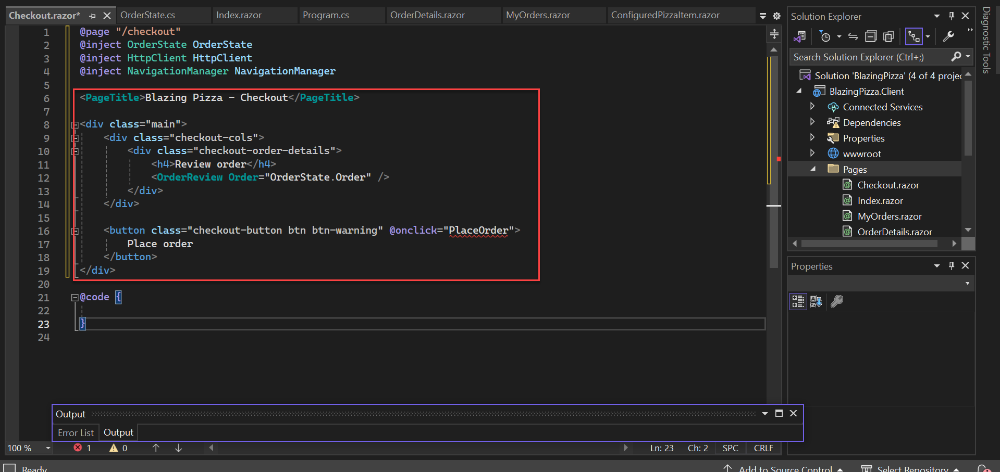

`PlaceOrder` を実装するために、`Index.razor` から同名のメソッドを `Checkout.razor` の `@code` ブロックにコピーします：

```razor
async Task PlaceOrder() {
    var response = await HttpClient.PostAsJsonAsync("orders", OrderState.Order);
    var newOrderId = await response.Content.ReadFromJsonAsync<int>();
    OrderState.ResetOrder();
    NavigationManager.NavigateTo($"myorders/{newOrderId}");
}
```

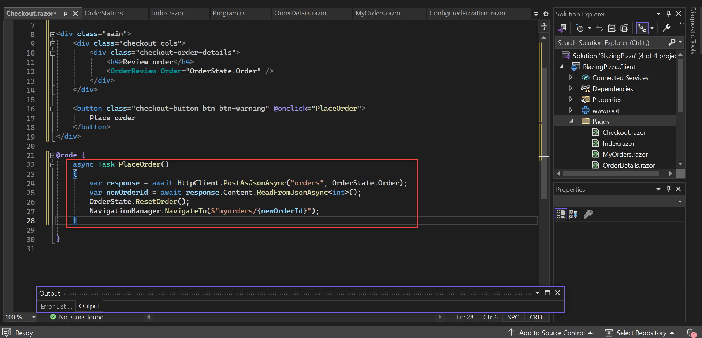

次に、顧客が注文を提出しようとしたときにこのページに誘導します。`Index.razor` に戻り、`PlaceOrder` メソッドを削除し、注文送信ボタンを次のように `/checkout` URL への通常の HTML リンクに変更します：

```razor
<a href="/checkout">注文を確定する</a>
```

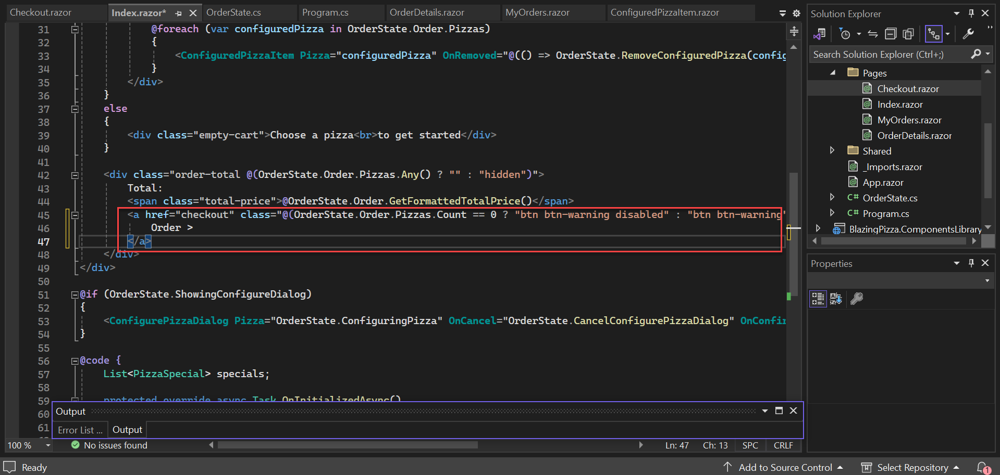

> 注：`disabled` 属性は HTML リンクではサポートされていないため削除しました。その代わりに適切なスタイルを追加しました。

アプリを実行すると、注文を確定するボタンをクリックすることでチェックアウトページに移動でき、そこで *Place order* ボタンをクリックして注文を確認できます。

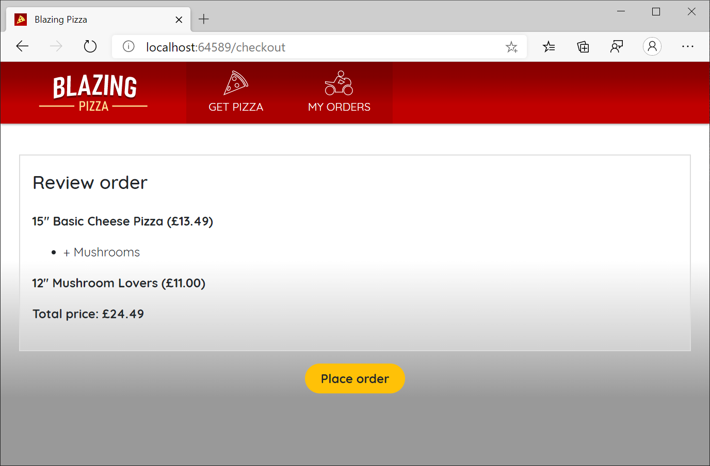

## タスク 2: 配送先住所の入力

現在、配送先住所を入力する UI を追加する良い場所ができました。通常通り、再利用可能なコンポーネントにまとめましょう。他の場所で住所の入力を求める可能性もあるためです。`BlazingPizza.Client` プロジェクトの `Shared` フォルダに `AddressEditor.razor` という新しい Razor ファイルを作成します。このファイルで `Address` インスタンスを編集する汎用的な方法を提供し、`@code` ブロック内でこの型のパラメータを受け取ります。

```razor
[Parameter]
public Address Address { get; set; }
```

ここでのマークアップは少し手間がかかるため、コピーして貼り付けることをお勧めします。`Address` の各プロパティ用に入力要素が必要です：

```razor
<label>Name:</label>
<input @bind="Address.Name" />

<label>Line 1:</label>
<input @bind="Address.Line1" />

<label>Line 2:</label>
<input @bind="Address.Line2" />

<label>City:</label>
<input @bind="Address.City" />

<label>Region:</label>
<input @bind="Address.Region" />

<label>Postal code:</label>
<input @bind="Address.PostalCode" />
```

最後に、`Checkout.razor` コンポーネント内で `AddressEditor` を実際に使用します：

```razor
<h4>配送先</h4>
<AddressEditor Address="OrderState.Order.DeliveryAddress" />
```

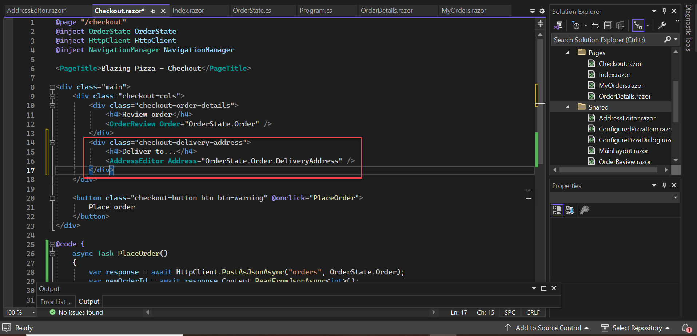

これでチェックアウト画面に配送先住所を入力する項目が表示されます。

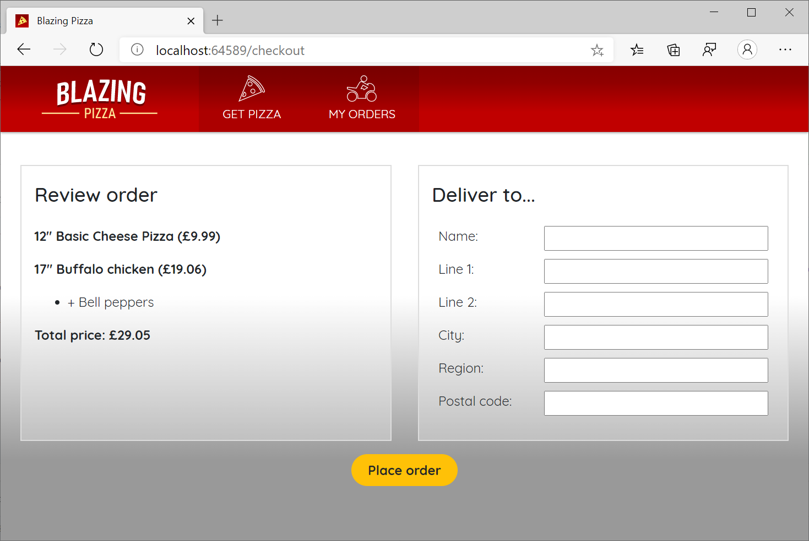

今注文を送信すると、入力した住所データが実際に注文と一緒にデータベースに保存されます。もしデータが保存されているか確認したければ、[DB Browser for SQLite](https://sqlitebrowser.org/) などのツールを使って `pizza.db` ファイルの内容を調査することができます。または、`BlazingPizza.Server` の `OrderController.PlaceOrder` メソッド内にブレークポイントを設定し、デバッガで受け取った `Order` オブジェクトを確認することも可能です。

## タスク 3: サーバーサイドバリデーションの追加

現時点では、顧客は「配送先住所」のフィールドを空白のままにしてピザの注文をすることが可能です。バリデーションに関しては、通常はサーバーとクライアントの両方でルールを実装します：

* クライアントサイドのバリデーションは、ユーザーにとっての利便性です。フォームを編集中に即時のフィードバックを提供できますが、ブラウザの開発ツールを使えば簡単にバイパスされてしまいます。
* サーバーサイドのバリデーションが実際の強制力です。したがって、まずサーバーサイドでバリデーションを実装してアプリがクライアントサイドの状況に関わらず堅牢であることを確認するのが一般的です。

`BlazingPizza.Server` プロジェクトの `OrdersController.cs` を確認すると、この API エンドポイントが `[ApiController]` 属性で装飾されていることがわかります：

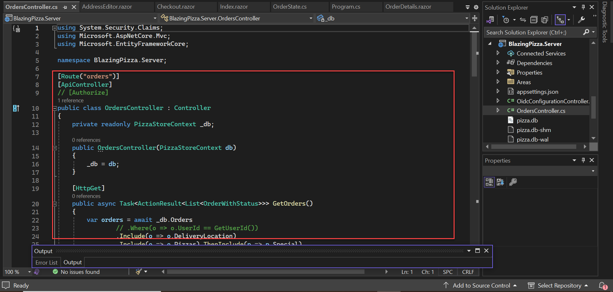

`[ApiController]` は `DataAnnotations` バリデーションルールの強制を含むさまざまなサーバーサイドの規約を追加します。したがって、モデルクラスにいくつかの `DataAnnotations` バリデーションルールを追加するだけで済みます。`BlazingPizza.Shared` プロジェクトの `Address.cs` を開き、`Id`（これはプライマリキーのため自動生成されます）と `Line2`（すべての住所に第2行が必要ではないため）を除く各プロパティに `[Required]` 属性を追加します。

```csharp
using System.ComponentModel.DataAnnotations;

public class Address {
    public int Id { get; set; }

    [Required, MaxLength(100)]
    public string Name { get; set; }

    [Required, MaxLength(100)]
    public string Line1 { get; set; }

    [MaxLength(100)]
    public string Line2 { get; set; }

    [Required, MaxLength(50)]
    public string City { get; set; }

    [Required, MaxLength(20)]
    public string Region { get; set; }

    [Required, MaxLength(20)]
    public string PostalCode { get; set; }
}
```

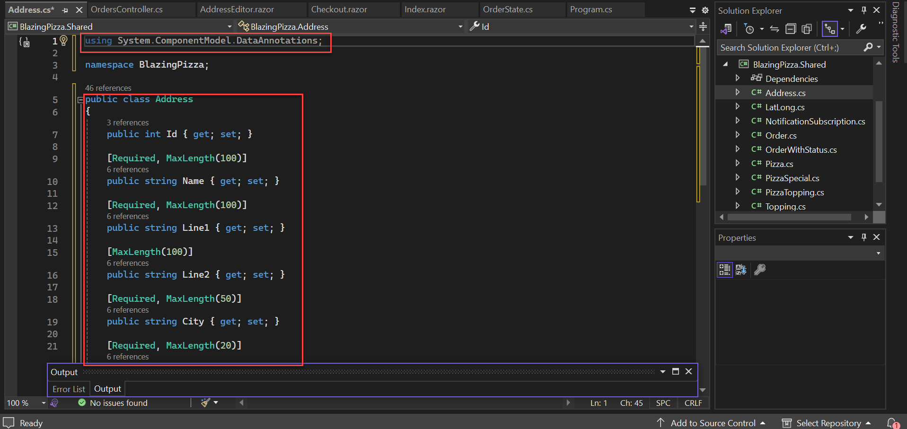

アプリを再コンパイルして実行すると、サーバーでバリデーションルールが強制されているのが確認できます。配送先住所が空白のままで注文を送信しようとすると、サーバーがリクエストを拒否し、ブラウザの開発ツールの *Network* タブに HTTP 400（「Bad Request」）エラーが表示されます。

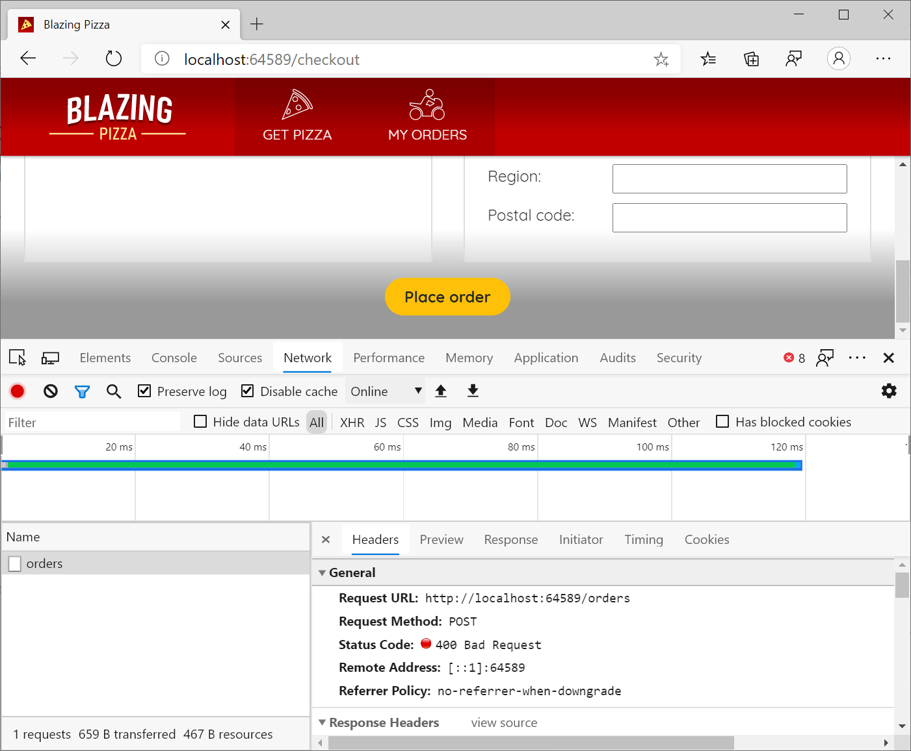

一方、住所フィールドを完全に入力すると、サーバーは注文の受け付けを許可します。これらのケースが期待通りに動作することを確認してください。

## タスク 4: クライアントサイドのバリデーションの追加

Blazor には、データ入力フォームとバリデーションのための包括的なシステムがあります。これを利用して、サーバー側ですでに適用されている `DataAnnotations` ルールをクライアントサイドでも適用します。

Blazor のフォームとバリデーションシステムは `EditContext` というものに基づいて動作します。`EditContext` は編集プロセスの状態を追跡し、どのフィールドが変更されたか、どのデータが入力されたか、フィールドが有効かどうかを把握します。さまざまな組み込み UI コンポーネントが `EditContext` にフックしてその状態を読み取り（例: バリデーションメッセージの表示）、またはその状態に書き込み（例: ユーザーが入力したデータの追加）ます。

### EditForm の使用

データ入力における最も重要な組み込み UI コンポーネントの1つが `EditForm` です。これは HTML の `<form>` タグとしてレンダリングされ、フォーム内部の状態を追跡する `EditContext` をセットアップします。`Checkout.razor` ファイルで、`main` div 内の全内容を `EditForm` で囲みます：

```razor
<EditForm Model="OrderState.Order.DeliveryAddress">
    <!-- チェックアウトの内容 -->
</EditForm>
```

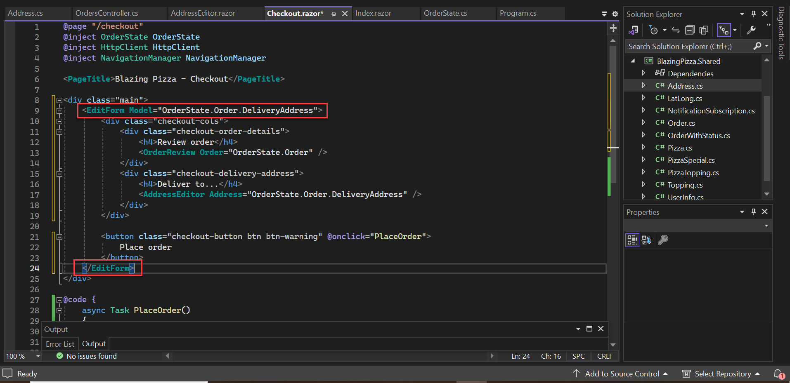

複数の `EditForm` コンポーネントを同時に使用できますが、重ねることはできません（HTML の `<form>` 要素が重なることはできないため）。`Model` を指定することで、フォームが送信されたときにバリデートするオブジェクトを内部の `EditContext` に指定しています（この場合は配送先住所です）。

まずバリデーションメッセージを非常に基本的な形で表示します。`EditForm` の中で、一番下に次の2つのコンポーネントを追加します：

```razor
<DataAnnotationsValidator />
<ValidationSummary />
```

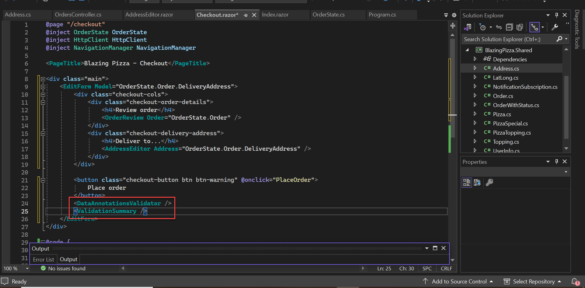

`DataAnnotationsValidator` は `EditContext` 上のイベントにフックし、`DataAnnotations` ルールを実行します。別のバリデーションシステムを使用したい場合は、`DataAnnotationsValidator` を他のものに置き換えればよいです。`ValidationSummary` は単に `EditContext` からのバリデーションメッセージを含む HTML の `<ul>` をレンダリングします。

これで、クライアントサイドでもバリデーションが実行されるようになりました。フォームが入力されていない状態で送信しようとすると、バリデーションメッセージが表示されます。
