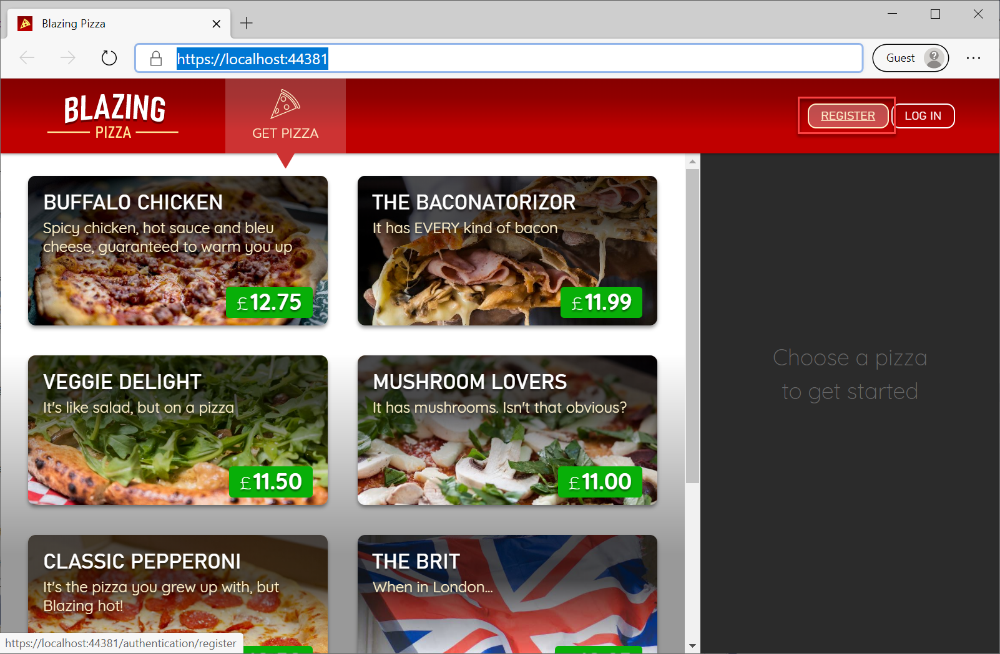

# エクササイズ 6: 認証と認可

アプリは順調に動作しています。ユーザーは注文を行い、その状況を追跡できます。しかし、1つ問題があります。現在、ユーザーを区別していません。「My Orders」ページには、すべてのユーザーが行ったすべての注文がリストされ、誰でも他のユーザーの注文状況を確認できる状態です。顧客やプライバシー規制にとって問題になる可能性があります。解決策は *認証* です。ユーザーがログインできる仕組みを導入し、誰が誰なのかを把握します。その後、*認可* を実装して、誰が何をできるかを制限します。

## タスク 1: サーバー側での強制

最初で最も重要な原則は、すべての「本当の」セキュリティルールはバックエンドサーバーで強制されるべきということです。クライアント（UI）は善良なユーザーに対する便宜のためにオプションを表示または非表示にしますが、悪意のあるユーザーがクライアント側のコードの動作を変更することは常に可能です。このため、クライアントコードがルールを認識する前に、バックエンドサーバーでいくつかのアクセスルールを強制します。

`BlazingPizza.Server` プロジェクト内にある `OrdersController.cs` ファイルを開きます。このコントローラークラスは、`/orders` および `/orders/{orderId}` に対する HTTP リクエストを処理します。これらのエンドポイントへのすべてのリクエストが認証されたユーザー（ログインしたユーザー）から来るようにするために、`OrdersController` クラスに `[Authorize]` 属性を追加します。


`AuthorizeAttribute` クラスは `Microsoft.AspNetCore.Authorization` 名前空間にあります。アプリを実行すると、注文を行ったり、すでに行った注文の詳細を取得することができなくなります。これらのエンドポイントへのリクエストは HTTP 401「許可されていません」応答を返し、UI にエラーメッセージが表示されます。これは、サーバー側でルールが適切に強制されていることを示しています！


## タスク 2: 認証状態の追跡

クライアントコードは、ユーザーがログインしているかどうか、そしてもしログインしている場合は*どのユーザー*がログインしているかを追跡する必要があります。これにより、UI の動作を制御することができます。Blazor には、これを行うための組み込みの DI サービスである `AuthenticationStateProvider` が用意されています。Blazor は、`AuthenticationStateProvider` サービスの実装およびその他の関連サービスとコンポーネントを [OpenID Connect](https://openid.net/connect/) に基づいて提供しており、ユーザーの身元を確立するための詳細をすべて処理します。これらのサービスとコンポーネントは、Microsoft.AspNetCore.Components.WebAssembly.Authentication パッケージで提供されており、クライアントプロジェクトに既に追加されています。

これらのサービスによって実装された認証プロセスは、大まかに次のようになります：

- ユーザーがログインを試みるか、保護されたリソースにアクセスしようとすると、アプリのログインページ（`/authentication/login`）にリダイレクトされます。
- ログインページで、アプリは構成済みの ID プロバイダーの認可エンドポイントにリダイレクトする準備をします。このエンドポイントは、ユーザーが認証されているかどうかを判断し、1つ以上のトークンを発行します。アプリは認証応答を受信するためのコールバックを提供します。
- ユーザーが認証されていない場合、ユーザーはまず基礎となる認証システム（通常は ASP.NET Core Identity）にリダイレクトされます。
- ユーザーが認証されると、認可エンドポイントは適切なトークンを生成し、ログインコールバックエンドポイント（`/authentication/login-callback`）にブラウザをリダイレクトします。
- Blazor WebAssembly アプリがログインコールバックエンドポイントを読み込むと、認証応答が処理されます。
- 認証プロセスが正常に完了した場合、ユーザーは認証され、ユーザーがリクエストした元の保護された URL にオプションでリダイレクトされます。

クライアントプロジェクトの `Program.cs` ファイルで、`AddApiAuthorization` を追加して認証サービスを有効にします：

```csharp
builder.Services.AddApiAuthorization();
```


追加されたサービスは、デフォルトでアプリと同じオリジンにある ID プロバイダーを使用するように構成されます。Blazing Pizza アプリのサーバープロジェクトでは、IdentityServer を ID プロバイダーとして使用し、ASP.NET Core Identity を認証システムとして使用するように既に設定されています：

*BlazingPizza.Server/Program.cs*


サーバーはクライアントアプリにトークンを発行するようにも設定されています：

*BlazingPizza.Server/appsettings.json*


これで、クライアントはユーザーの認証状態を追跡し、保護されたリソースにアクセスできるようになります。

## タスク 3: ログイン状態の表示

クライアントプロジェクトの `Shared` フォルダに `LoginDisplay.razor` という新しい Razor ファイルを作成します。その内容を以下のように置き換えます：

```html
@inject NavigationManager Navigation
@inject SignOutSessionStateManager SignOutManager

<AuthorizeView>
    <Authorized>
        <span>Hello, @context.User.Identity.Name!</span>
        <button @onclick="BeginSignOut">Sign out</button>
    </Authorized>
    <NotAuthorized>
        <a href="authentication/login">Log in</a>
    </NotAuthorized>
</AuthorizeView>

@code{
    async Task BeginSignOut() {
        await SignOutManager.SetSignOutState();
        Navigation.NavigateTo("authentication/logout");
    }
}
```


`AuthorizeView` は、ユーザーが指定された認可条件を満たしているかどうかに応じて、異なる内容を表示する組み込みのコンポーネントです。この場合、ユーザーが認証されている場合に「こんにちは、[ユーザー名]」と表示し、「Sign out」ボタンを表示します。認証されていない場合は「Log in」リンクが表示されます。

`LoginDisplay` を `MainLayout.razor` に追加し、UI に表示します。

## タスク 4: ユーザーの登録とログイン

アプリを実行し、新しいユーザーを登録してみましょう。ホームページで「Register」を選択します。



新しいユーザーのメールアドレスとパスワードを入力し、「Register」をクリックします。


ユーザー登録を完了するには、メールアドレスの確認が必要です。開発中は、リンクをクリックしてアカウントを確認できます。


ユーザーのメールが確認されたら、ページ上部の「Login」を選択し、ユーザーのメールアドレスとパスワードを入力して「Login」をクリックします。


ユーザーがログインし、ホームページにリダイレクトされます。


## タスク 5: アクセストークンのリクエスト

ログインしたユーザーを識別できるようになったので、クライアントがサーバーからデータを取得する際に、ユーザーに関連付けられたデータのみを取得できるようにします。アクセストークンを使ってクライアントがサーバーに認証されるように構成します。

この手順で、認証されたユーザーのみが `My Orders` ページで自分の注文を確認できるようになります。
