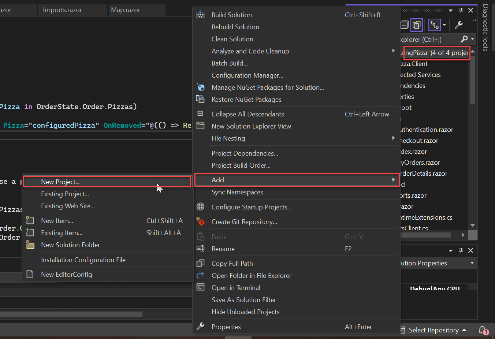
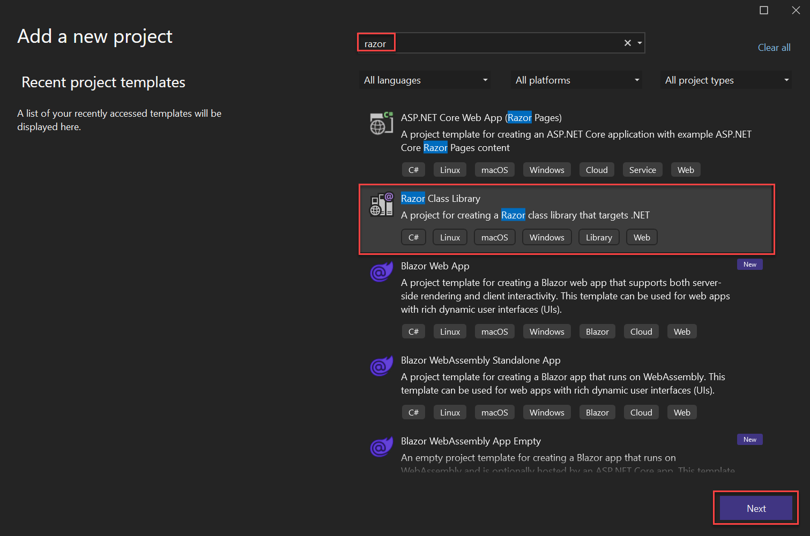
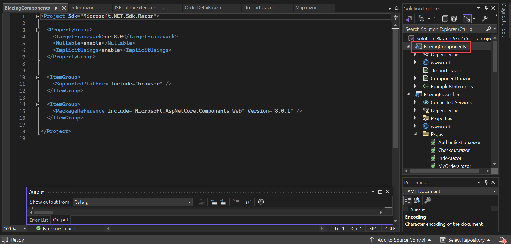
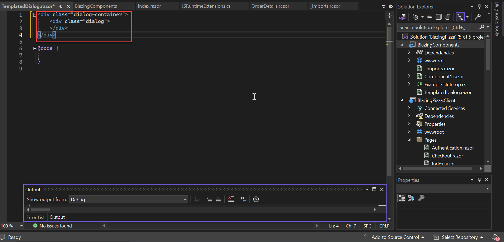

# エクササイズ 8: テンプレート化されたコンポーネント

オリジナルのコンポーネントのいくつかをリファクタリングし、再利用性を向上させましょう。また、新しいコンポーネントのホームとして、独立したライブラリプロジェクトを作成します。

Razor クラス ライブラリ テンプレートを使用して、新しいプロジェクトを作成します。

## タスク 1: コンポーネントライブラリの作成（Visual Studio）

Visual Studio を使用して、ソリューションエクスプローラーの一番上にある「Solution...」を右クリックし、「Add」→「New Project」を選択します。



次に、`Razor Class Library` テンプレートを検索して選択します。「Next」をクリックします。



プロジェクト名を `BlazingComponents` と入力し、「Next」、次に「Create」をクリックします。

## タスク 2: ライブラリプロジェクトの理解

ソリューションエクスプローラーで `BlazingComponents` プロジェクト名をダブルクリックして、プロジェクトファイルを開きます。ここでは特に変更を加えませんが、いくつか重要な点を理解しておきましょう。

表示される内容は次のようになります：



いくつか重要な点があります。

まず、パッケージのターゲットが `netstandard2.0` です。Blazor Server は `netcoreapp3.1` を使用し、Blazor WebAssembly は `netstandard2.1` を使用していますが、`netstandard2.0` をターゲットにすることでどちらのシナリオでも動作します。

次に、`<RazorLangVersion>3.0</RazorLangVersion>` が Razor 言語バージョンを設定しています。バージョン 3 は、コンポーネントと `.razor` ファイル拡張子のサポートに必要です。

最後に、`<PackageReference />` 要素は Blazor コンポーネントモデルへのパッケージ参照を追加します。

## テンプレート化されたダイアログの作成

`Index` の一部であるダイアログシステムに戻り、アプリケーションから独立させて利用できるようにします。

再利用可能なダイアログは、表示や非表示の制御だけでなく、ダイアログの内容を受け入れる必要があります。内容をパラメータとして受け取るコンポーネントをテンプレート化コンポーネントと呼びます。Blazor には、この用途にぴったりの機能があり、これはレイアウトと似ています。レイアウトでは `Body` パラメータがあり、レイアウトが `Body` の周りに他の内容を配置できます。`Body` パラメータは `RenderFragment` 型で、これはランタイムが特別な処理を行うデリゲート型です。この機能はレイアウトに限られず、任意のコンポーネントが `RenderFragment` 型のパラメータを宣言できます。

新しいダイアログコンポーネントを作成するため、`BlazingComponents` プロジェクトに `TemplatedDialog.razor` という名前の新しい Razor ファイルを作成します。ファイルの上部に次のマークアップを追加します：

```razor
<div class="dialog-container">
    <div class="dialog">

    </div>
</div>
```



まだ機能はありませんが、パラメータを追加していきます。ダイアログの内容を受け入れ、表示を制御できるようにするためのパラメータを追加します。
